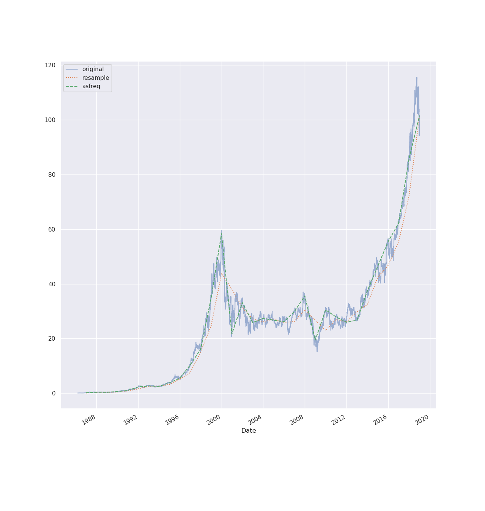
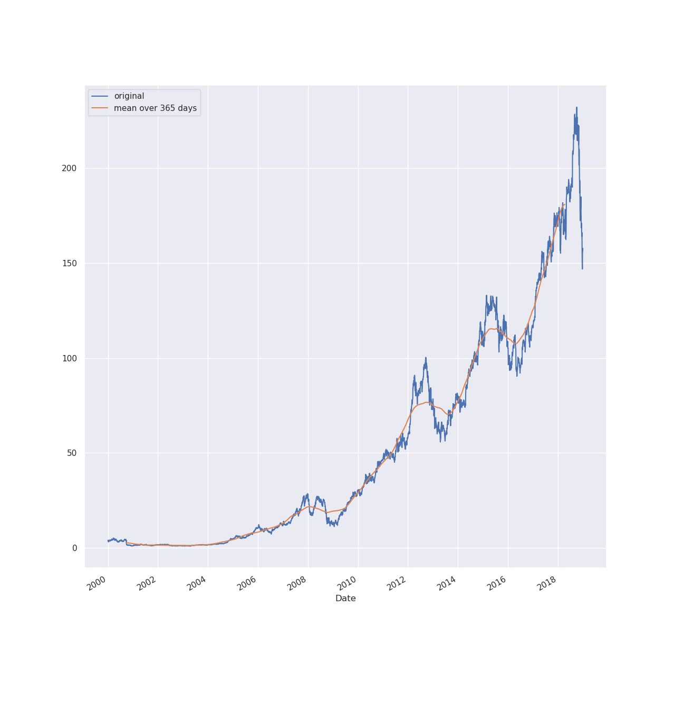

# Pandas

Pandas is a package built on top of NumPy, which offers powerful data
operations familiar to those of data bases and spreadsheets. The fundamental
data structures of Pandas are `Series`, `DataFrame` and `Index`. A `DataFrame`
is a multidimensional array with labeled rows and columns, which supports
heterogeneous and missing data—an issue often to be faced with in real-world
data sets.

Pandas is idiomatically imported as `pd`:

```python
>>> import pandas as pd
```

## Series

What NumPy's `ndarray` is to Python's list, Pandas `Series` is to Python's
dictionary: a fast and very powerful alternative. Whereas Python's dictionary
maps a set of _arbitrary keys_ to  a set of _arbitrary values_, Pandas `Series`
maps a set of _typed keys_ to a set of _typed values_. A `Series` is made up of
two sequences:

1. `values`: a NumPy array (`np.ndarray`)
2. `index`: a Pandas Index (`pd.Index`)

### Creation

A Pandas `Series` can be created from scalars, lists and dictionaries.

If a `Series` is generated from list, the indices (first column) for the values
(second column) are made up automatically, i.e. sequentially:

```python
>>> pd.Series([1, 2, 3])
0    1
1    2
2    3
dtype: int64
```

An list of indices can be explicitly provided using the `index` parameter. The
the lists of values and indices need to have the same length:

```python
>>> pd.Series([1, 2, 3], index=['a', 'b', 'c'])
a    1
b    2
c    3
dtype: int64
```

However, indices can be noncontiguous and nonsequential:

```python
>>> pd.Series([1, 2, 3], index=['Foo', 'Bar', 'Qux'])
Foo    1
Bar    2
Qux    3
dtype: int64
```

If a scalar value is used instead of list of values, the same value will be
repeated for the length of the `index` list:

```python
>>> pd.Series(42, index=[1, 2, 3])
1    42
2    42
3    42
dtype: int64
```

A `Series` can be created based on a dictionary with keys to be used as
indices:

```python
>>> pd.Series({'a': 1, 'b': 2, 'c': 3})
a    1
b    2
c    3
dtype: int64
```

An additional list of indices can be provided to further select values from the
dictionary by their keys, and to specify the order of entries:

```python
>>> pd.Series({'a': 1, 'b': 2, 'c': 3}, index=['c', 'a'])
c    3
a    1
dtype: int64
```

### Access: Indexing and Selection

The elements of a `Series` can be accessed using indexing and slicing:

```python
>>> s = pd.Series([1, 2, 3, 4, 5])
>>> s[0]
1

>>> s[4]
5

>>> s[1:4]
1    2
2    3
3    4
dtype: int64
```

If arbitrary (noncontiguous, nonsequential) indices are used, slicing is
possible because of the fixed order of indices, but the upper bound is also
included:

```python
>>> payroll = pd.Series({'Dilbert': 120000, 'Wally': 80000, 'Alice': 110000})
>>> payroll['Dilbert':'Wally']
Dilbert  120000
Wally     80000
dtype: int64
```

Even though a non-numeric is used, a `Series` can also be sliced using a
implicit index. Here, the upper bound is excluded:

```python
>>> payroll[0:2]
Dilbert    120000
Wally       80000
dtype: int64
```

The elements of a `Series` can also be accessed through the means of masking
and fancy indexing:

```python
>>> payroll[(payroll >= 100000) & (payroll <= 150000)]
Dilbert    120000
Alice      110000
dtype: int64

>>> payroll[['Alice', 'Dilbert']]
Alice      110000
Dilbert    120000
dtype: int64
```

Python's native dictionary expressions are also supported:

```python
>>> 'Dilbert' in payroll
True

>>> 'Asok' in payroll
False

>>> payroll.keys()
Index(['Dilbert', 'Wally', 'Alice'], dtype='object')

>>> list(payroll.items())
[('Dilbert', 120000), ('Wally', 80000), ('Alice', 110000)]

>>> payroll['Wally'] = 90000 # modify existing entry
>>> payroll['Asok']  = 12000 # add a new entry
```

### Explicit and Implicit Indexing

When using a explicit integer index, indexing operations make use of the
explicit indices (the actual index values provided), but slicing operations use
the implicit indices (the items ordinal numbers). This can be confusing:

```python
>>> ratings = pd.Series([2.3, 3.1, 3.9, 4.2, 4.8], index=[10, 20, 30, 40, 50])
>>> ratings[10] # explicit index
2.3

>>> ratings[1:3] # implicit index
20    3.1
30    3.9
dtype: float64
```

In order to reduce that confusion, a `Series` offers two attributes to access
the indices:

- `loc`: the explicit index
- `iloc`: the implicit index

```python
>>> ratings.loc[10]
2.3

>>> ratings.loc[10:30] # inclusive explicit indices from 10 to 30
10    2.3
20    3.1
30    3.9
dtype: float64


>>> ratings.iloc[0]
2.3

>>> ratings.iloc[0:3] # exclusive implicit indices from 0 to 3
10    2.3
20    3.1
30    3.9
dtype: float64
```

According to the [Zen of Python](https://www.python.org/dev/peps/pep-0020/)
(«Explicit is better than implicit.»), slicing and indexing on `Series` using a
integer index should be done using the `loc` and `iloc` attributes,

## DataFrame

A Pandas `DataFrame` can be understood in terms of other data structures from
two perspectives:

1. As a generalization of a NumPy array of two dimensions, with row indices and
   column names being flexible.
    - NumPy arrays are indexed as `arr[row, column]`: row first, column second.
    - Pandas `DataFrame`s are indexed as `df[column][row]`: column first, row
      of the `Series` second.
2. As a specialization of a Python dictionary that maps a column name (key) to
   a `Series` of column data (value).

Generally speaking, a `DataFrame` is a sequence of `Series` sharing the index
value. Important attributes are:

- `columns`: returns an `Index` object (column names)
- `index`: returns the index labels (row names)

### Creation

A Pandas `DataFrame` can be created from `Series`, dictionaries and NumPy arrays.

If a single `Series` is provided, an optional column name for those values can
be defined in a list:

```python
>>> s = pd.Series([1, 2, 3])
>>> pd.DataFrme(s, columns=['values'])
   values
0       1
1       2
2       3
```

If a list of dictionaries is provided, each dictionary is mapped to a row.
Missing entries of heterogeneous dictionaries are filled up with `NaN` in the
resulting `DataFrame`:

```python
>>> pd.DataFrame([{'a': 1, 'b': 2}, {'a': 5, 'c': 4}])
   a    b    c
0  1  2.0  NaN
1  5  NaN  4.0
```

If a dictionary of `Series` is provided, each `Series` becomes a column with
its key mapped as the column name:

```python
>>> s1 = pd.Series([2, 4, 6, 8])
>>> s2 = pd.Series[(3, 6, 9, 12])
>>> pd.DataFrame({'two': s1, 'three': s2})
   two  three
0    2      3
1    4      6
2    6      9
3    8     12
```

If a two-dimensional NumPy array is provided, the numeric column and row
indices from the array are used, but can be set using the optional `columns`
and `index` parameters:

```python
>>> arr = np.arange(1, 10).reshape(3, 3)
>>> pd.DataFrame(arr)
   0  1  2
0  1  2  3
1  4  5  6
2  7  8  9

>>> pd.DataFrame(arr, columns=['A', 'B', 'C'], index=[1, 2, 3])
   A  B  C
1  1  2  3
2  4  5  6
3  7  8  9
```

If a structured NumPy array is provided, the field names serve as column names:

```python
>>> employees = np.zeros(3, dtype=np.dtype([('name', 'S10'), ('wage', 'f8')]))
>>> employees['name'] = ['Dilbert', 'Wally', 'Alice']
>>> employees['wage'] = [120000.00, 80000.00, 110000.00]
>>> pd.DataFrame(employees)
         name      wage
0  b'Dilbert'  120000.0
1    b'Wally'   80000.0
2    b'Alice'  110000.0
```

### Access: Indexing and Selection

The `DataFrame` for the following examples:

```python
>>> population = {
... 'USA': 326625792,
... 'Russia': 142257520,
... 'Germany': 80594016,
... 'Switzerland': 8236303
... }

>>> area = {
... 'USA': 9147593,
... 'Russia': 16377742,
... 'Germany': 348672,
... 'Switzerland': 39997
... }

>>> data = pd.DataFrame({'pop': population, 'area': area})
>>> data
                   pop      area
Germany       80594016    348672
Russia       142257520  16377742
Switzerland    8236303     39997
USA          326625792   9147593
```

Individual columns can be accessed either dictionary-style or attribute-style,
however the latter only works for columns with a string index that isn't used
for any other `DataFrame` attribute:

```python
>>> data['area']
Germany          348672
Russia         16377742
Switzerland       39997
USA             9147593
Name: area, dtype: int64

>>> data.area
Germany          348672
Russia         16377742
Switzerland       39997
USA             9147593
Name: area, dtype: int64

>>> data['area'] is data.area
True

>>> data['pop'] is data.pop
False # pop is a method of DataFrame!
```

For assignments, only dictionary-style access works (on the left side):

```python
>>> data['density'] = data['pop'] / data.area
>>> data
                   pop      area     density
Germany       80594016    348672  231.145650
Russia       142257520  16377742    8.686028
Switzerland    8236303     39997  205.923019
USA          326625792   9147593   35.706201
```

The raw, underlying multi-dimensional array of data of a `DataFrame` can be
accessed using the `value` attribute, which supports array-style indexing:

```python
>>> data.values
array([[8.05940160e+07, 3.48672000e+05, 2.31145650e+02],
       [1.42257520e+08, 1.63777420e+07, 8.68602766e+00],
       [8.23630300e+06, 3.99970000e+04, 2.05923019e+02],
       [3.26625792e+08, 9.14759300e+06, 3.57062007e+01]])

>>> data.values[0, 0]
80594016.0
```

A transposed version of the `DataFrame` (which rows and columns swapped) can be
accessed using the `T` attribute:

```python
>>> data.T
              Germany        Russia   Switzerland           USA
pop      8.059402e+07  1.422575e+08  8.236303e+06  3.266258e+08
area     3.486720e+05  1.637774e+07  3.999700e+04  9.147593e+06
density  2.311456e+02  8.686028e+00  2.059230e+02  3.570620e+01
```

A `DataFrame` offers different index attributes:

- `loc`: explicit index to access values by column and row _names_
    - inclusive upper bound
    - supports name based slicing, masking, fancy indexing
- `iloc`: implicit index to access values by column and row _numbers_
    - zero-based, exclusive upper bound
    - supports row and column access by ordinal numbers

```python
>>> data.loc['Germany':'Russia', 'pop':'area']
               pop      area
Germany   80594016    348672
Russia   142257520  16377742

>>> data.loc[data.density > 100, ['pop', 'density']]
                  pop     density
Germany      80594016  231.145650
Switzerland   8236303  205.923019

>>> data.iloc[0:2, 0:2]
               pop      area
Germany   80594016    348672
Russia   142257520  16377742
```

## Index

The Pandas `Index` is an immutable array/a ordered (multi)set that is used both
for the indexing of `Series` and `DataFrame`.

An `Index` can be created from a list:

```python
>>> pd.Index([1, 2, 3, 4, 5])
Int64Index([1, 2, 3, 4, 5], dtype='int64')
```

The elements of the `Index` can be accessed like list entries, i.e. by a single
index and using slicing:

```python
>>> idx = pd.Index([1, 2, 3, 4, 5])
>>> idx[2]
3

>>> idx[0:2]
Int64Index([1, 2], dtype='int64')

>>> idx[::2]
Int64Index([1, 3, 5], dtype='int64')
```

An `Index` is immutable, which is important when they are shared between
different `DataFrame`s and `Series`:

```python
>>> idx[2] = 6
TypeError: Index does not support mutable operations
```

Like Python's native set, `Index` supports set operations like intersection,
union and difference:

```python
>>> idxA.intersection(idxB)
Int64Index([1, 3, 5], dtype='int64')

>>> idxA.union(idxB)
Int64Index([1, 2, 3, 4, 5, 7, 9], dtype='int64')

>>> idxA.difference(idxB)
Int64Index([7, 9], dtype='int64')

>>> idxB.difference(idxA)
Int64Index([2, 4], dtype='int64')

>>> idxA.symmetric_difference(idxB)
Int64Index([2, 4, 7, 9], dtype='int64')
```

Union, intersection and symmetric difference can be expressed by the means of
operators:

```python
>>> idxA & idxB # intersection
Int64Index([1, 3, 5], dtype='int64')

>>> idxA | idxB # union
Int64Index([1, 2, 3, 4, 5, 7, 9], dtype='int64')

>>> idxA ^ idxB # symmetric difference
Int64Index([2, 4, 7, 9], dtype='int64')
```

## Operations

Pandas offers a lot of functions like NumPy's UFuncs that can be applied on a
`Series` or `DataFrame` either using a method (with another `Seris` or
`DataFrame` as a argument) or using a Python operator:

| Operator    | Method                           | Description         |
|-------------|----------------------------------|---------------------|
| `+`         | `add()`                          | Addition            |
| `-`         | `sub()`, `subtract()`            | Subtraction         |
| `*`         | `mul()`, `multiply()`            | Multiplication      |
| `/`         | `truediv()`, `div()`, `divide()` | Division            |
| `//`        | `floordiv()`                     | Floor Division      |
| `%`         | `mod()`                          | Modulus (remainder) |
| `**`        | `pow()`                          | Exponentiation      |

The index of the operands is preserved in the result. If the operands are
heterogeneous, the result contains the union of the two indices, with `NaN`
filled in for missing values:

```python
>>> hours = pd.Series([25, 40, 32], index=['Alice', 'Bob', 'Malory'])
>>> rates = pd.Series([45, 50, 30], index=['Alice', 'Bob', 'Thomas'])
>>> hours * wages
Alice     1125.0
Bob       2000.0
Malory       NaN
Thomas       NaN
dtype: float64
```

An operation that mixes a `Series` and a `DataFrame` works like an operation on
a one-dimensional and a multi-dimensional array; broadcasting rules (similar as
those for NumPy) apply:

```python
>>> wages = pd.DataFrame({'January': {'Alice': 4500, 'Bob': 4800},
...                       'February': {'Alice': 4200, 'Bob': 4500}})
>>> wages
       January  February
Alice     4500      4200
Bob       4800      4500

>>> increase = pd.Series({'Alice': 1.2, 'Bob': 1.1})
>>> increase
Alice    1.2
Bob      1.1
dtype: float64

>>> wages.T * increase # with transposition
           Alice     Bob
January   5400.0  5280.0
February  5040.0  4950.0

>>> wages.multiply(increase, axis=0) # with optional axis (increase as rows)
       January  February
Alice   5400.0    5040.0
Bob     5280.0    4950.0
```

Pandas always preserves indices and column names, so that the data context is
maintained.

## Handling Missing Data

Real-world data sets are rarely clean and homogeneous. Oftentimes, values are
missing, and the lack of a value is indicated in different ways. Pandas marks
the absence of a value in two different ways:

1. `None`: a Python singleton object, which is used in `object` collections
   (rather slow due to the overhead).
2. `NaN`: a special floating point value (not a number), which is defined in
   the IEEE-754 standard and used for numeric collections. NumPy's `NaN`
   reference is used: `np.nan`.

A `Series` and `DataFrame` containing a `None` or `NaN` «value» is upcast
according to the types of the other elements: integer types are upcast to
`float64`; booleans are upcast to `object`.

```python
>>> pd.Series([1, 2, None]) # None replaced by NaN
0    1.0
1    2.0
2    NaN
dtype: float64

>>> pd.Series([1, 2, np.nan])
0    1.0
1    2.0
2    NaN
dtype: float64

>>> pd.Series([True, False, None]) # None preserved
0     True
1    False
2     None
dtype: object

>>> pd.Series([True, False, np.nan])
0     True
1    False
2      NaN
dtype: object
```

Any operation involving `NaN` yields `NaN`:

```python
>>> 3 + np.nan
nan

>>> (3 + 7) * np.nan
nan

>>> pd.Series([1, 2, np.nan]) + pd.Series([1, np.nan, 3])
0    2.0
1    NaN
2    NaN
dtype: float64
```

Whereas NumPy supports special `NaN`-aware functions (`np.nansum()`,
`np.nanmax()`), Pandas offers special functions to deal with absent values:

`isnull()` and `notnull()` return a boolean mask indicating if there is no
value (`isnull`) or a value (`notnull`) at the respective index. These masks
can be used for indexing:

```python
>>> s = pd.Series([1, np.nan, 3])
>>> s.isnull()
0    False
1     True
2    False
dtype: bool

>>> s.notnull()
0     True
1    False
2     True
dtype: bool

>>> s[s.notnull()]
0    1.0
2    3.0
dtype: float64
```

`dropna()` removes `None` and `NaN` entries in a `Series`. In a `DataFrame`,
the full row or column missing a value is removed, which can be defined using
the optional `axis` parameter:

```python
>>> farmers = ['Miller', 'Shaw', 'Watson']
>>> dogs = pd.Series([1, 2, 1], index=farmers)
>>> cats = pd.Series([3, 1, np.nan], index=farmers)
>>> cows = pd.Series([7, np.nan, 2], index=farmers)
>>> pigs = pd.Series([0, 2, np.nan], index=farmers)
>>> livestock = pd.DataFrame( {'dogs': dogs, 'cats': cats, 'cows': cows, 'pigs': pigs})
>>> livestock
        dogs  cats  cows  pigs
Miller     1   3.0   7.0   0.0
Shaw       2   1.0   NaN   2.0
Watson     1   NaN   2.0   NaN

>>> livestock.dropna() # default: axis='rows'
        dogs  cats  cows  pigs
Miller     1   3.0   7.0   0.0

>>> livestock.dropna(axis='columns')
        dogs
Miller     1
Shaw       2
Watson     1
```

By default, every row/column with at least one missing entry is dropped. If the
optional `how` parameter is set to `all`, only rows/columns with missing values
only are dropped:

```pythpon
>>> livestock.dropna() # default: how='any'
        dogs  cats  cows  pigs
Miller     1   3.0   7.0   0.0

>>> livestock.dropna(how='all')
        dogs  cats  cows  pigs
Miller     1   3.0   7.0   0.0
Shaw       2   1.0   NaN   2.0
Watson     1   NaN   2.0   NaN
```

The optional parameter `thresh` allows to define a threshold: only drop
rows/columns with fewer values given:

```python
>>> livestock.dropna(thresh=3) # drop rows with fewer than three values
        dogs  cats  cows  pigs
Miller     1   3.0   7.0   0.0
Shaw       2   1.0   NaN   2.0

>>> livestock.dropna(thresh=3, axis='columns')
        dogs
Miller     1
Shaw       2
Watson     1
```

`fillna()` fills in a value where one is missing. Either a scalar value can be
passed, or the value from a neighbouring cell can be propagated using a
combination of the `method` (`ffill`/`bfill`: forward and backward fill) and
`axis` (`rows`/`columns`) parameters:

```python
>>> livestock.fillna(0) # replace NaN with 0, which is useful for sums
        dogs  cats  cows  pigs
Miller     1   3.0   7.0   0.0
Shaw       2   1.0   0.0   2.0
Watson     1   0.0   2.0   0.0

>>> livestock.fillna(method='ffill', axis='rows') # propagate value to next row
        dogs  cats  cows  pigs
Miller     1   3.0   7.0   0.0
Shaw       2   1.0   7.0   2.0
Watson     1   1.0   2.0   2.0

>>> livestock.fillna(method='bfill', axis='columns') # ... from previous column
        dogs  cats  cows  pigs
Miller   1.0   3.0   7.0   0.0
Shaw     2.0   1.0   2.0   2.0
Watson   1.0   2.0   2.0   NaN
```

If there is no next or previous row or column, `NaN` entries could still remain
after the `fillna()` operation.

## Hierarchical Indexing

Pandas `Series` and `DataFrame` represent one- and two-dimensional data. But
some data must be indexed by more than two indices, and values can only be
accessed by a combination of all those indices. This concept is called
_hierarchical indexing_ or _multi-indexing_.

A index with multiple levels could be represented by a tuple (using Formula 1
teams and seasons as indices):

```python
>>> index = [
    ('Mercedes', 2018), ('Mercedes', 2017),
    ('Ferrari', 2018), ('Ferrari', 2017),
    ('McLaren', 2018), ('McLaren', 2017)]
>>> points = pd.Series([655, 688, 571, 522, 62, 30], index=index)
>>> points
(Mercedes, 2018)    655
(Mercedes, 2017)    688
(Ferrari, 2018)     571
(Ferrari, 2017)     522
(McLaren, 2018)      62
(McLaren, 2017)      30
dtype: int64
```

However, storing a tuple as the index is inconvenient and inefficient for data
access. Therefore Pandas offers `MultiIndex`, an efficient wrapper for tuple
indices:

```python
>>> multi_index = pd.MultiIndex.from_tuples(index)
>>> multi_index
MultiIndex(levels=[['Ferrari', 'McLaren', 'Mercedes'], [2017, 2018]],
           labels=[[2, 2, 0, 0, 1, 1], [1, 0, 1, 0, 1, 0]])
```

The `MultiIndex` has two `levels` (the team names and seasons), and they are
combined with `labels` like this:

| Team     | `labels[0]` | `labels[1]` | Season |
|----------|-------------|-------------|--------|
| Mercedes | 2           | 1           | 2018   |
| Mercedes | 2           | 0           | 2017   |
| Ferrari  | 0           | 1           | 2018   |
| Ferrari  | 0           | 0           | 2017   |
| McLaren  | 1           | 1           | 2018   |
| McLaren  | 1           | 0           | 2017   |

A `Series` created with a tuple index can be reindexed using a `MultiIndex`:

```python
>>> points = points.reindex(multi_index)
>>> points
Mercedes  2018    655
          2017    688
Ferrari   2018    571
          2017    522
McLaren   2018     62
          2017     30
dtype: int64
```

The blank space below the team index means that the value from above is used.

A `DataFrame` with additional columns can be created based on the existing
`DataFrame`:

```python
>>> f1 = pd.DataFrame({
    'points': points,
    'races': [21, 20, 21, 20, 21, 20],
    'wins': [11, 12, 6, 5, 0, 0]})
>>> f1
               points  races  wins
Mercedes 2018     655     21    11
         2017     688     20    12
Ferrari  2018     571     21     6
         2017     522     20     5
McLaren  2018      62     21     0
         2017      30     20     0
```

The operations mentioned earlier can also be applied:

```python
>>> win_ratio = f1['wins'] / f1['races']
>>> win_ratio
Mercedes  2018    0.523810
          2017    0.600000
Ferrari   2018    0.285714
          2017    0.250000
McLaren   2018    0.000000
          2017    0.000000
dtype: float64
```

### Creation of Hierarchical Indices

A hierarchical index can be created implicitly, i.e. together with the `Series`
or the `DataFrame`.

The index can be passed as an additional argument to the constructor as a list
of index arrays:

```python
>>> points = [655, 688, 571, 522]
>>> index = [['Mercedes', 'Mercedes', 'Ferrari', 'Ferrari'],
             [2018, 2017, 2018, 2017]]
>>> pd.Series(points, index=index)
Mercedes  2018    655
          2017    688
Ferrari   2018    571
          2017    522
dtype: int64
```

Or a dictionary can be passed to the constructor, with appropriate index tuples
as keys:

```python
>>> points = {('Mercedes', 2018): 655, ('Mercedes', 2017): 688,
              ('Ferrari', 2018): 571, ('Ferrari', 2017): 522}
>>> pd.Series(points)
Mercedes  2018    655
          2017    688
Ferrari   2018    571
          2017    522
dtype: int64
```

Using one of `MultiIndex` class methods, a hierarchical index can be created
explicitly. The resulting object can be passed to the constructor of a `Series`
or a `DataFrame` as the `index` attribute.

The method `from_arrays` accepts a list of index arrays:

```python
>>> pd.MultiIndex.from_arrays([['Mercedes', 'Mercedes', 'Ferrari', 'Ferrari'],
                               [2018, 2017, 2018, 2017]])
MultiIndex(levels=[['Ferrari', 'Mercedes'], [2017, 2018]],
           labels=[[1, 1, 0, 0], [1, 0, 1, 0]])
```

The method `from_tuples` accepts a list of index tuples:

```python
>>> pd.MultiIndex.from_tuples([('Mercedes', 2018), ('Mercedes', 2017),
                               ('Ferrari', 2018), ('Ferrari', 2017)])
MultiIndex(levels=[['Ferrari', 'Mercedes'], [2017, 2018]],
           labels=[[1, 1, 0, 0], [1, 0, 1, 0]])
```

In the above examples, every item from the first index (`['Mercedes',
'Ferrari']`) has been combined with every item from the second index (`[2018,
2017]`) _manually_. This Cartesian product can also be created automatically
using the `from_product` method:

```python
>>> pd.MultiIndex.from_product([['Mercedes', 'Ferrari'], [2018, 2017]])
MultiIndex(levels=[['Ferrari', 'Mercedes'], [2017, 2018]],
           labels=[[1, 1, 0, 0], [1, 0, 1, 0]])
```

The index levels can also be combined manually using a nested list of labels
passed to the constructor of `MultiIndex`. This is especially helpful, if only
certain combinations of index entries need to be created:

```python
>>> index = pd.MultiIndex(levels=[['Manor', 'Haas'], [2015, 2016, 2017]],
                          labels=[[0,0,1,1], [0,1,1,2]])
>>> pd.Series([0, 1, 29, 47], index=index)
Manor  2015     0
       2016     1
Haas   2016    29
       2017    47
dtype: int64
```

Using a `DataFrame`, both rows and columns can have multiple indices:

```python
>>> row_index = pd.MultiIndex.from_product([['Mercedes', 'Ferrari'],
                                            [2018, 2017]])
>>> col_index = pd.MultiIndex.from_product([['Australia', 'Bahrain'],
                                            ['Driver 1', 'Driver 2']])
>>> pos = np.array([2, 8, 3, 2, 2, 3, 2, 3, 1, 3, 1, np.nan, 1, 4, 1, 4])
>>> f1 = pd.DataFrame(pos.reshape((4, 4)), index=row_index, columns=col_index)
>>> f1
              Australia           Bahrain
               Driver 1 Driver 2 Driver 1 Driver 2
Mercedes 2018       2.0      8.0      3.0      2.0
         2017       2.0      3.0      2.0      3.0
Ferrari  2018       1.0      3.0      1.0      NaN
         2017       1.0      4.0      1.0      4.0
```

This allows for four-dimensional indices.

Both row and column index can be named by setting a list of row/column names
with the appropriate length to the `names` attribute of the index:

```python
>>> f1.index.names = ['Team', 'Season']
>>> f1.columns.names = ['GP', 'Driver']
>>> f1
GP              Australia           Bahrain
Driver           Driver 1 Driver 2 Driver 1 Driver 2
Team     Season
Mercedes 2018         2.0      8.0      3.0      2.0
         2017         2.0      3.0      2.0      3.0
Ferrari  2018         1.0      3.0      1.0      NaN
         2017         1.0      4.0      1.0      4.0
```

### Indexing and Slicing

Indexing and Slicing on `Series` is row based. This `Series` index has a
species as the first (higher level) index, and the year as the second (lower
level) index:

```python
>>> idx = pd.MultiIndex.from_product([['cats', 'cows', 'dogs', 'pigs'],
                                        [2000, 2005, 2010]])
>>> livestock = pd.Series([32, 16, 25, 60, 75, 52, 1, 1, 2, 4, 3, 7], index=idx)
>>> livestock
cows  2000    32
      2005    16
      2010    25
pigs  2000    60
      2005    75
      2010    52
dogs  2000     1
      2005     1
      2010     2
cats  2000     4
      2005     3
      2010     7
dtype: int64
```

Individual values can be accessed using full indexing by first indicating the
higher level index and second the lower level index:

```python
>>> livestock['cats', 2000]
4
>>> livestock['cows', 2010]
25
>>> livestock['pigs', 2005] - livestock['pigs', 2010]
23
```

If the lower level index is left unspecified, a `Series` with the lower level
index retained is returned:

```python
>>> livestock['cows']
2000    32
2005    16
2010    25
dtype: int64
```

Passing an empty slice for the higher level index allows indexing on the lower
level index:

```python
>>> livestock[:, 2010]
cows    25
pigs    52
dogs     2
cats     7
dtype: int64
```

Slicing on the explicit index is only available on a dataset with a sorted
`MultiIndex`. Either the dataset is created using a sorted `MultiIndex`:

```python
>>> idx = idx.sort_values()
>>> livestock = pd.Series([4, 3, 7, 32, 16, 25, 1, 1, 2, 60, 75, 52], index=idx)
```

Or the `MultiIndex` on the existing dataset is sorted, returning a new dataset:

```python
>>> livestock = livestock.sort_index()
```

The indices are sorted lexicographically. Then the slicing operations can be
performed (on the explicit index):

```python
>>> livestock.loc['cats':'cows', 2000:2005]
cats  2000     4
      2005     3
cows  2000    32
      2005    16
dtype: int64
```

Selections can be made based on boolean masks:

```python
>>> livestock[livestock > 10]
cows  2000    32
      2005    16
      2010    25
pigs  2000    60
      2005    75
      2010    52
dtype: int64
```

Values can be selected using fancy indexing:

```python
>>> livestock[['cows', 'pigs']]
cows  2000    32
      2005    16
      2010    25
pigs  2000    60
      2005    75
      2010    52
dtype: int64
```

The indexing hierarchy on a `DataFrame` behaves like the one of a `Series`,
expect that a `DataFrame` is indexed by columns first:

```python
>>> row_idx = pd.MultiIndex.from_product([[2017, 2018],
                                          ['Jan', 'Jul']])
>>> col_idx = col_idx = pd.MultiIndex.from_product([['Tom', 'Jim'],
                                                    ['height', 'weight']])
>>> val = [[122, 35, 129, 37],
           [128, 37, 131, 39],
           [134, 39, 135, 41],
           [137, 40, 138, 43]]
>>> kids = pd.DataFrame(val, columns=col_idx, index=row_idx)
>>> kids
            Tom           Jim
         height weight height weight
2017 Jan    122     35    129     37
     Jul    128     37    131     39
2018 Jan    134     39    135     41
     Jul    137     40    138     43

>>> kids['Tom', 'height']
2017  Jan    122
      Jul    128
2018  Jan    134
      Jul    137
Name: (Tom, height), dtype: int64
```

For row-oriented selection on a `DataFrame`, the implicit index can be used:

```python
>>> kids.iloc[0:2]
            Tom           Jim
         height weight height weight
2017 Jan    122     35    129     37
     Jul    128     37    131     39
```

The column index hierarchy can be expressed using the explicit index and
tuples:

```python
>>> kids.loc[:, ('Tom', 'weight')]
2017  Jan    35
      Jul    37
2018  Jan    39
      Jul    40
Name: (Tom, weight), dtype: int64
```

Because tuples do not support slices, Pandas offers the `IndexSlice` object:

```python
>>> jan = pd.IndexSlice[:, 'Jan']
>>> weight = pd.IndexSlice[:, 'weight']
>>> kids.loc[jan, weight]
            Tom    Jim
         weight weight
2017 Jan     35     37
2018 Jan     39     41
```

### Rearranging Multi-Indices

Conceputally, a `Series` with two indices is a lot like a `DataFrame`, which
maps the first index to the rows and the second index to the columns. A
multi-index `Series` can be converted to a `DataFrame` using the `Series`
`unstack()` method:

```python
>>> idx = pd.MultiIndex.from_product([[2017, 2018],
                                      ['Bezos', 'Gates', 'Buffet']]) 
>>> billions = [72.8, 75.6, 86.0, 112, 84, 90]
>>> richest = pd.Series(billions, index=idx.sort_values())
>>> richest
2017  Bezos      72.8
      Buffet     75.6
      Gates      86.0
2018  Bezos     112.0
      Buffet     84.0
      Gates      90.0
dtype: float64

>>> richest.unstack()
      Bezos  Buffet  Gates
2017   72.8    75.6   86.0
2018  112.0    84.0   90.0
```

An optional level can be defined to indicate which index level is to be
transformed into a column level:

```python
>>> richest.unstack(level=0)
        2017   2018
Bezos   72.8  112.0
Buffet  75.6   84.0
Gates   86.0   90.0

>>> richest.unstack(level=1)
      Bezos  Buffet  Gates
2017   72.8    75.6   86.0
2018  112.0    84.0   90.0
```

The `DataFrame` can be converted back to a multi-index `Series` using the
`stack()` method. The column index will become the lower level index of the row
`MultiIndex`:

```python
>>> richest.unstack(level=0).stack()
Bezos   2017     72.8
        2018    112.0
Buffet  2017     75.6
        2018     84.0
Gates   2017     86.0
        2018     90.0
dtype: float64
```

The indices of a dataset can be turned into regular columns using the
`reset_index()` method, which allows to name the existing data column using an
optional argument:

```python
>>> richest.index.names = ['year', 'person']
>>> table = richest.reset_index(name='billions')
>>> table
   year  person  billions
0  2017   Bezos      72.8
1  2017  Buffet      75.6
2  2017   Gates      86.0
3  2018   Bezos     112.0
4  2018  Buffet      84.0
5  2018   Gates      90.0
```

Data columns can also be turned (back) into a `MultiIndex` using the
`set_index()` method, which expects a list of columns to be used as indices:

```python
>>> table.set_index(['year', 'person'])
             billions
year person
2017 Bezos       72.8
     Buffet      75.6
     Gates       86.0
2018 Bezos      112.0
     Buffet      84.0
     Gates       90.0
```

Aggregation methods have optional `level` and `axis` parameters, which allow
for partial aggregations:

```python
>>> richest.mean(level='year')
year
2017    78.133333
2018    95.333333
dtype: float64

>>> richest.mean(level='person')
person
Bezos     92.4
Buffet    79.8
Gates     88.0
dtype: float64

>>> richest.unstack(level=0).mean(axis=0)
year
2017    78.133333
2018    95.333333
dtype: float64

>>> richest.unstack(level=0).mean(axis=1)
person
Bezos     92.4
Buffet    79.8
Gates     88.0
dtype: float64
```

`level` and `axis` can also be combined, which is useful if both row and column
use a `MultiIndex`.

### Multi-Indices vs. Panels

Datasets using a `MultiIndex` are _sparse representations_ of data: only the
existing values are represented. Panels (classes `Panel` and `Panel4D`), in
contrast, are _dense representations_ of data. A value is stored for every
combination of all indices. Since real-world data sets are often sparse,
`MultiIndex` datasets are often more efficient than panels.

## Combining Datasets

Conducting interesting studies of data often requires combining datasets from
different sources. Pandas offers different facilities to perform this task:
concatenations and database-style joins.

### Concat and Append

To demonstrate the concatenation of datasets, this function is used to create a
`DataFrame` quickly with values made up of column names and row indices:

```python
def create_df(cols, index):
    data = {c: [str(c) + str(i) for i in index] for c in cols}
    return pd.DataFrame(data, index)
```

The function can be used thus:

```python
>>> create_df('ABC', range(3))
    A   B   C
0  A0  B0  C0
1  A1  B1  C1
2  A2  B2  C2
```

Multiple `Series` or `DataFrame`s can be combined using Pandas `concat`
function, which expects a list of datasets:

```python
>>> a = create_df('ABC', [1, 2, 3])
>>> b = create_df('ABC', [4, 5, 6])
>>> pd.concat([a, b])
    A   B   C
1  A1  B1  C1
2  A2  B2  C2
3  A3  B3  C3
4  A4  B4  C4
5  A5  B5  C5
6  A6  B6  C6
```

By default, the concatenation is performed row-wise (default parameter
`axis=0`). The concatenation can be performed column-wise by setting the `axis`
parameter either to `1`:

```python
>>> a = create_df('ABC', [1, 2, 3])
>>> b = create_df('DEF', [1, 2, 3])
>>> pd.concat([a, b], axis=1)
    A   B   C   D   E   F
1  A1  B1  C1  D1  E1  F1
2  A2  B2  C2  D2  E2  F2
3  A3  B3  C3  D3  E3  F3
```

By default, indices are preserved, even if the resulting index contains
duplicates:

```python
>>> a = create_df('ABC', [0, 1, 2])
>>> b = create_df('ABC', [2, 3, 4])
>>> pd.concat([a, b])
    A   B   C
0  A0  B0  C0
1  A1  B1  C1
2  A2  B2  C2
2  A2  B2  C2
3  A3  B3  C3
4  A4  B4  C4
```

The index `2` occurs twice in the resulting dataset above. There are different
ways to deal with duplicate indices. The first is to raise an error in case of
conflict by setting the `verify_integrity` flag to `True`:

```python
>>> pd.concat([a, b], verify_integrity=True)
ValueError: Indexes have overlapping values: Int64Index([2], dtype='int64')
```

An other option is to ignore the existing indices and let Pandas create a new
one by setting the `ignore_index` flag to `True`:

```python
>>> pd.concat([a, b], ignore_index=True)
    A   B   C
0  A0  B0  C0
1  A1  B1  C1
2  A2  B2  C2
3  A2  B2  C2
4  A3  B3  C3
5  A4  B4  C4
```

The existing indices can be converted to a `MultiIndex` by introducing a
higher-level index key describing the source of the entries in the resulting
dataset using the `keys` parameter:

```python
>>> pd.concat([a, b], keys=['a', 'b'])
      A   B   C
a 0  A0  B0  C0
  1  A1  B1  C1
  2  A2  B2  C2
b 2  A2  B2  C2
  3  A3  B3  C3
  4  A4  B4  C4
```

If datasets with columns in common are concatenated, the resulting dataset is a
union of the source datasets (default parameter `join='outer'`). Missing values
(in uncommon columns) are filled up as `NaN`:

```python
>>> a = create_df('ABC', range(3))
>>> b = create_df('BCD', range(3))
>>> pd.concat([a, b])
     A   B   C    D
0   A0  B0  C0  NaN
1   A1  B1  C1  NaN
2   A2  B2  C2  NaN
0  NaN  B0  C0   D0
1  NaN  B1  C1   D1
2  NaN  B2  C2   D2
```

If the resulting dataset should only consist of the columns in common of the
source datasets, setting the parameter `join='inner'` will create a dataset as
an intersection of the source columns:

```python
>>> pd.concat([a, b], join='inner')
    B   C
0  B0  C0
1  B1  C1
2  B2  C2
0  B0  C0
1  B1  C1
2  B2  C2
```

For fine-grained control of the resulting columns, the parameter `join_axes`
can be set to a `Index` object representing the output columns:

```python
>>> pd.concat([a, b], join_axes=[pd.Index(['A', 'B', 'C'])])
     A   B   C
0   A0  B0  C0
1   A1  B1  C1
2   A2  B2  C2
0  NaN  B0  C0
1  NaN  B1  C1
2  NaN  B2  C2
```

An existing `Index` object of the source datasets can also be used:

```python
>>> pd.concat([a, b], join_axes=[a.columns])
     A   B   C
0   A0  B0  C0
1   A1  B1  C1
2   A2  B2  C2
0  NaN  B0  C0
1  NaN  B1  C1
2  NaN  B2  C2
```

The `append()` method of a `DataFrame` is a shorthand for the `pd.concat()`
function:

```python
>>> a = create_df('ABC', range(3))
>>> b = create_df('ABC', [3, 4, 5])
>>> a.append(b)
    A   B   C
0  A0  B0  C0
1  A1  B1  C1
2  A2  B2  C2
3  A3  B3  C3
4  A4  B4  C4
5  A5  B5  C5
```

It should not be used when combining more than two datasets, because new
indices and data buffers are created for every intermediary step.

### Merge and Join

Pandas offers high-performance, in-memory join and merge operations. The
`pd.merge()` function is the main interface, but `DataFrame` and `Series` also
offer a `join()` method for higher convenience.

There are three types of joins:

1. one-to-one (1:1)
2. one-to-many (1:n)
3. many-to-many (n:m)

The type of join to be performed depends solely on the input data.

A one-to-one join is similar to column-wise concatenation. The datasets are
automatically joined using a column common to both datasets:

```python
>>> employees = pd.DataFrame(
        {'employee': ['Dilbert', 'Catbert', 'Pointy Haired Boss'],
         'department': ['Engineering', 'HR', 'Management']})
>>> employees
             employee   department
0             Dilbert  Engineering
1             Catbert           HR
2  Pointy Haired Boss   Management

>>> departments = pd.DataFrame(
        {'department': ['Management', 'HR', 'Engineering'],
         'location': ['upper floor', 'middle floor', 'basement']})
>>> departments
    department      location
0   Management   upper floor
1           HR  middle floor
2  Engineering      basement

>>> pd.merge(employees, departments)
             employee   department      location
0             Dilbert  Engineering      basement
1             Catbert           HR  middle floor
2  Pointy Haired Boss   Management   upper floor
```

The index of the input datasets is discarded; a new index is generated for the
resulting dataset. The order of entries in the output may be different from the
input.

If one of the key columns contains duplicates, a one-to-many join is performed.
Using the same `departments`, but a extended `employees` dataset:

```python
>>> employees = pd.DataFrame(
        {'employee': ['Dilbert', 'Wally', 'Catbert', 'Pointy Haired Boss'],
         'department': ['Engineering', 'Engineering', 'HR', 'Management']})
>>> employees
             employee   department
0             Dilbert  Engineering
1               Wally  Engineering
2             Catbert           HR
3  Pointy Haired Boss   Management

>>> pd.merge(employees, departments)
             employee   department      location
0             Dilbert  Engineering      basement
1               Wally  Engineering      basement
2             Catbert           HR  middle floor
3  Pointy Haired Boss   Management   upper floor
```

If the key columns on both sides contain duplicates, a many-to-many join is
performed:

```python
>>> employees = pd.DataFrame(
        {'name': ['Dilbert', 'Wally', 'Catbert'],
         'department': ['Engineering', 'Engineering', 'HR']})
>>> employees
      name   department
0  Dilbert  Engineering
1    Wally  Engineering
2  Catbert           HR

>>> skills = pd.DataFrame(
        {'skill': ['programming', 'thinking', 'thinking', 'manipulating'],
         'department': ['Engineering', 'Engineering', 'HR', 'HR']})
>>> skills
          skill   department
0   programming  Engineering
1      thinking  Engineering
2      thinking           HR
3  manipulating           HR

>>> pd.merge(employees, skills)
      name   department         skill
0  Dilbert  Engineering   programming
1  Dilbert  Engineering      thinking
2    Wally  Engineering   programming
3    Wally  Engineering      thinking
4  Catbert           HR      thinking
5  Catbert           HR  manipulating
```

These examples all assume _one column common to both datasets_, which is often
not given in real-world datasets. The behaviour of `merge()` can be further
specified to overcome this constraint.

If there are multiple common columns in both datasets, the column to be joined
on can be defined using the `on` parameter:

```python
>>> employees = pd.DataFrame(
        {'id': [1, 2, 3],
         'name': ['Dilbert', 'Wally', 'Catbert'],
         'department': ['Engineering', 'Engineering', 'HR']})
>>> employees
   id     name   department
0   1  Dilbert  Engineering
1   2    Wally  Engineering
2   3  Catbert           HR

>>> departments = pd.DataFrame(
        {'id': [1, 2],
         'department': ['Engineering', 'HR'],
         'location': ['basement', 'middle floor']})
>>> departments
   id   department      location
0   1  Engineering      basement
1   2           HR  middle floor

>>> pd.merge(employees, departments, on='department')
   id_x     name   department  id_y      location
0     1  Dilbert  Engineering     1      basement
1     2    Wally  Engineering     1      basement
2     3  Catbert           HR     2  middle floor
```

If the columns to be joined have a different name, the join can be defined
using the `left_on` and `right_on` parameters:

```python
>>> employees = pd.DataFrame(
        {'id': [1, 2, 3],
         'name': ['Dilbert', 'Wally', 'Catbert'],
         'department_id': [1, 1, 2]})
>>> employees
   id     name  department_id
0   1  Dilbert              1
1   2    Wally              1
2   3  Catbert              2

>>> departments = pd.DataFrame(
        {'id': [1, 2, 3],
         'department': ['Engineering', 'HR', 'Management']})
>>> departments
   id   department
0   1  Engineering
1   2           HR
2   3   Management

>>> pd.merge(employees, departments,
             left_on='department_id', right_on='id')
   id_x     name  department_id  id_y   department
0     1  Dilbert              1     1  Engineering
1     2    Wally              1     1  Engineering
2     3  Catbert              2     2           HR
```

Redundant columns can be removed from the output using the `drop()` method by
providing the name of the column to be discarded, and the argument `axis=1` to
specify that the column has to be dropped (as opposed to the row with
`axis=0`):

```python
>>> pd.merge(employees, departments,
             left_on='department_id', right_on='id').drop('id_x', axis=1)
      name  department_id  id_y   department
0  Dilbert              1     1  Engineering
1    Wally              1     1  Engineering
2  Catbert              2     2           HR
```

Joins can also be performed based on the index instead of on columns. Using the
datasets `employees` and `department` from above with appropriate indices, the
join can be performed by setting the `left_index` and `right_index` flags to
`True`:

```python
>>> employees = employees.set_index('id')
>>> employees
       name  department_id
id
1   Dilbert              1
2     Wally              1
3   Catbert              2

>>> departments = departments.set_index('id')
>>> departments
     department
id
1   Engineering
2            HR
3    Management

>>> pd.merge(employees, departments, left_index=True, right_index=True)
       name  department_id   department
id
1   Dilbert              1  Engineering
2     Wally              1           HR
3   Catbert              2   Management
```

Merging on the index is the default behaviour of the `join()` method:

```python
>>> employees.join(departments)
       name  department_id   department
id
1   Dilbert              1  Engineering
2     Wally              1           HR
3   Catbert              2   Management
```

Merging on indices and columns can also be mixed, specifying either the
`left_on`/`right_index` or the `left_index`/`right_on` parameter pairs:

```python
>>> employees = pd.DataFrame({
        'id': [1, 2, 3],
        'name': ['Dilbert', 'Wally', 'Catbert'],
        'department_id': [1, 1, 2]})
>>> employees
   id     name  department_id
0   1  Dilbert              1
1   2    Wally              1
2   3  Catbert              2

>>> departments = pd.DataFrame({
        'id': [1, 2, 3],
        'department': ['Engineering', 'HR', 'Management']})
>>> departments = departments.set_index('id')
>>> departments
     department
id
1   Engineering
2            HR
3    Management

>>> pd.merge(employees, departments, left_on='department_id', right_index=True)
   id     name  department_id   department
0   1  Dilbert              1  Engineering
1   2    Wally              1  Engineering
2   3  Catbert              2           HR
```

The type of the join to be performed in terms of set arithmetic can be defined
using the `how` keyword. The default option is `inner`; only entries common to
both input datasets are contained in the result:

```python
>>> employees = pd.DataFrame({
        'employee': ['Dilbert', 'Pointy Haired Boss', 'Dogbert'],
        'department': ['Engineering', 'Management', 'Evil Operations']})
>>> employees
             employee       department
0             Dilbert      Engineering
1  Pointy Haired Boss       Management
2             Dogbert  Evil Operations

>>> departments = pd.DataFrame({
        'department': ['Engineering', 'Management', 'Marketing'],
        'location': ['basement', 'upper floor', 'middle floor']})
>>> departments
    department      location
0  Engineering      basement
1   Management   upper floor
2    Marketing  middle floor

>>> pd.merge(employees, departments, how='inner')
             employee   department     location
0             Dilbert  Engineering     basement
1  Pointy Haired Boss   Management  upper floor
```

The option `outer` fills up missing entries (i.e. entries not common to both
input datasets) with `NaN` in the result:

```python
>>> pd.merge(employees, departments, how='outer')
             employee       department      location
0             Dilbert      Engineering      basement
1  Pointy Haired Boss       Management   upper floor
2             Dogbert  Evil Operations           NaN
3                 NaN        Marketing  middle floor
```

The options `left` and `right` preserve all values from the `left` resp.
`right` side, and fill up all the missing entries on the other side with `NaN`:

```python
>>> pd.merge(employees, departments, how='left')
             employee       department     location
0             Dilbert      Engineering     basement
1  Pointy Haired Boss       Management  upper floor
2             Dogbert  Evil Operations          NaN

>>> pd.merge(employees, departments, how='right')
             employee   department      location
0             Dilbert  Engineering      basement
1  Pointy Haired Boss   Management   upper floor
2                 NaN    Marketing  middle floor
```

If the two input datasets have columns with the same name that are not used to
perform the join operation, a suffix (`_x` and `_y`) is added to both columns
to prevent conflicts:

```python
>>> employees.index.names = ['id']
>>> employees = employees.reset_index()
>>> employees
   id            employee       department
0   0             Dilbert      Engineering
1   1  Pointy Haired Boss       Management
2   2             Dogbert  Evil Operations

>>> departments.index.names = ['id']
>>> departments = departments.reset_index()
>>> departments
   id   department      location
0   0  Engineering      basement
1   1   Management   upper floor
2   2    Marketing  middle floor

>>> pd.merge(employees, departments, on='department')
   id_x            employee   department  id_y     location
0     0             Dilbert  Engineering     0     basement
1     1  Pointy Haired Boss   Management     1  upper floor
```

A list of custom suffixes can be set using the `suffixes` parameter:

```python
>>> pd.merge(employees, departments, on='department', suffixes=['_emp', '_dep'])
   id_emp            employee   department  id_dep     location
0       0             Dilbert  Engineering       0     basement
1       1  Pointy Haired Boss   Management       1  upper floor
```

## Aggregation

Computing aggregations is an essential technique for efficient summarization of
data sets. The `planets` dataset of the `seaborn` package is useful for
practicing aggregations:

```python
>>> import seaborn as sns
>>> planets = sns.load_dataset('planets')
```

A good starting point is to get an overview over the dataset using the
`describe()` function, which is a convenience method that performs a couple of
aggregations for the purpose of understanding rather than further processing
the data:

```python
>>> planets.describe()
            number  orbital_period        mass     distance         year
count  1035.000000      992.000000  513.000000   808.000000  1035.000000
mean      1.785507     2002.917596    2.638161   264.069282  2009.070531
std       1.240976    26014.728304    3.818617   733.116493     3.972567
min       1.000000        0.090706    0.003600     1.350000  1989.000000
25%       1.000000        5.442540    0.229000    32.560000  2007.000000
50%       1.000000       39.979500    1.260000    55.250000  2010.000000
75%       2.000000      526.005000    3.040000   178.500000  2012.000000
max       7.000000   730000.000000   25.000000  8500.000000  2014.000000
```

Important aggregation functions are:

| Function   | Returns                               |
|------------|---------------------------------------|
| `count()`  | number of entries (`NaN` not counted) |
| `min()`    | minimum value                         |
| `max()`    | maximum value                         |
| `sum()`    | sum (addition)                        |
| `prod()`   | product (multiplication)              |
| `mean()`   | mean (arithmetic average)             |
| `median()` | median (middle value)                 |
| `std()`    | standard deviation                    |
| `var()`    | variance                              |
| `mad()`    | mean absolute deviation               |

Aggregations on a `DataFrame` result in summarized columns. To aggregate rows
instead of columns, the `axis` parameter ban be set accordingly:

```python
>>> planets.mean(axis='columns')
```

The `axis` parameters describe what is to be aggregated (the _columns_ of each
row), not what the result should be!

## Grouping

Grouping allows to split a dataset up based on its values or index, perform
computations within the groups and combine the group results together to
overall results. Grouping is a three-step process:

1. split: breaking up and grouping a `DataFrame` (based on the values of a
   specified key or other property)
2. apply: perform computations within each group:
    1. filter: remove or retain values for further processing
    2. transform: map the input values to output values
    3. aggregate: reduce the multitude of values to a single value (or a
       smaller amount of values)
    4. apply: perform computations on the aggregation result(s)
3. combine: merge the results to a single resulting dataset

The `groupby()` method allows to perform those three steps together in an
efficient way. When called on a `DataFrame`, it returns a `DataFrameGroupBy`
object, which is a special (grouped) view onto the underlying `DataFrame`:

```python
>>> import seaborn as sns
>>> planets = sns.load_dataset('planets')
>>> planets.groupby('year')
<pandas.core.groupby.groupby.DataFrameGroupBy object at 0x7f9db32f2eb8>
```

A `DataFrameGroupBy` is a collection of `DataFrame`s that allows for the
operations filter, transform, aggregate and apply.  No computation is performed
until an aggregation is applied (lazy evaluation), which returns a new
`DataFrame`:

```python
>>> planets.groupby('year').sum()
      number  orbital_period       mass  distance
year
1989       1       83.888000   11.68000     40.57
1992       6       91.803900    0.00000      0.00
1994       3       98.211400    0.00000      0.00
...
```

Selecting a column on a `DataFrameGroupBy` object returns a `SeriesGroupBy`
object, which can be also used for aggregations and the like:

```python
>>> planets.groupby('year')['distance']
<pandas.core.groupby.groupby.SeriesGroupBy object at 0x7f9db3224f60>
```

A `GroupBy` object allows to iterate over the individual groups, yielding the
group key and the `DataFrame`:

```python
>>> for (key, df) in planets.groupby('year'):
        print(key, ', '.join(df.columns))
1989 method, number, orbital_period, mass, distance, year
1992 method, number, orbital_period, mass, distance, year
1994 method, number, orbital_period, mass, distance, year
...
```

However, the `apply()` method is usually faster and more convenient than an
explicit iteration.

When a method of a `DataFrame` is called on a `GroupBy` object, it is
dispatched to each of the underlying `DataFrame` objects:

```python
>>> planets.groupby('year').first()
               method  number  orbital_period     mass  distance
year
1989  Radial Velocity       1       83.888000  11.6800     40.57
1992    Pulsar Timing       3       25.262000      NaN       NaN
1994    Pulsar Timing       3       98.211400      NaN       NaN
...
```

As mentioned earlier, after grouping and before combining the data, different
operations can be performed on the grouped data.

The `filter()` method executes a predicate function (or lambda expression) on
every entry, retains it in the dataset (matching condition) or discards it from
the dataset (not matching condition). The predicate function/lambda expression
expects a `DataFrame` and returns a boolean:

```python
>>> teams = ['Mercedes', 'Mercedes', 'Ferrari', 'Ferrari']
>>> drivers = ['Hamilton', 'Bottas', 'Vettel', 'Raikkoennen']
>>> points = [408, 247, 320, 251]
>>> championship = df.DataFrame(
        {'team': teams, 'driver': drivers, 'points': points})
>>> championship
       team       driver  points
0  Mercedes     Hamilton     408
1  Mercedes       Bottas     247
2   Ferrari       Vettel     320
3   Ferrari  Raikkoennen     251

>>> championship.groupby('team').filter(lambda x: x['points'].mean() > 300)
       team    driver  points
0  Mercedes  Hamilton     408
1  Mercedes    Bottas     247
```

The `DataFrame` is grouped by team. For every team the mean of points scored is
calculated, and only entries with a team's point mean above 300 are retained.
This filtering uses a predicate function:

```python
>>> def below_600(x):
        return x['points'].sum() < 600
>>> championship.groupby('team').filter(below_600)
      team       driver  points
2  Ferrari       Vettel     320
3  Ferrari  Raikkoennen     251
```

The `transform()` method allows to map the input data record by record to
output data of the same shape:

```python
>>> championship.groupby('team')['points'].transform(lambda x: x / x.mean())
0    1.245802
1    0.754198
2    1.120841
3    0.879159
```

Each driver's ratio of points scored to the team is computed in terms of mean
points per team. Notice that the `points` column was selected, so `x` refers to
a `Series`, not to a `DataFrame`.

The `aggregate()` method allows to reduce a group in two fundamental ways:

First, by applying one or more aggregation functions that are passed either as
a function or as a function name (string):

```python
>>> championship.groupby('team').aggregate([min, 'max'])
               driver           points
                  min       max    min  max
team
Ferrari   Raikkoennen    Vettel    251  320
Mercedes       Bottas  Hamilton    247  408
```

Second, by applying different aggregation functions for each column, by
providing a dictionary that maps a function to every column:

```python
>>> championship['position'] = [1, 5, 2, 3]
>>> championship.groupby('team').aggregate({'points': max, 'position': min})
          points  position
team
Ferrari      320         2
Mercedes     408         1
```

The `apply()` method allows to execute a function on every group result. It
takes a `DataFrame`/`Series` and returns either a `DataFrame`/`Series` object,
or the function reduces the group results further to a single scalar:

```python
>>> championship.groupby('team')['points'].apply(sum)
team
Ferrari     571
Mercedes    655
Name: points, dtype: int64
```

The grouping of the data is not limited to a single column name. Different
alternatives are available.

First, provide a list/array/series/index of group keys, telling every entry in
which group to go:

```python
>>> names = ['Harry Potter', 'Draco Malfoy', 'Hermine Granger', 'Ron Weasley']
>>> students = pd.Series(names)
>>> houses = ['Griffindor', 'Slytherin', 'Griffindor', 'Griffindor']
>>> students.groupby(houses).apply(lambda s: ', '.join(s))
Griffindor    Harry Potter, Hermine Granger, Ron Weasley
Slytherin                                   Draco Malfoy
dtype: object
```

Second, provide a dictionary that maps the index keys to groups:

```python
>>> courses = ['Math', 'English', 'History', 'Geography', 'Music', 'Biology']
>>> results = ['A', 'C', 'E', 'B', 'D', 'F']
>>> grouping = {'A': 'good', 'B': 'good', 'C': 'ok', 'D': 'ok', 'E': 'bad', 'F': 'bad'}
>>> marks = pd.DataFrame({'course': courses, 'result': results})
>>> marks = marks.set_index('result')
>>> marks
           course
result
A            Math
C         English
E         History
B       Geography
D           Music
F         Biology

>>> marks.groupby(grouping).aggregate(lambda c: ', '.join(c))
                course
bad   History, Biology
good   Math, Geography
ok      English, Music
```

Third, provide any function that maps a input (index) to a output (group):

```python
>>> lectures = ['Math: Calculus', 'Math: Statistics',
        'Computer Science: Algorithms', 'Computer Science: Data Structures']
>>> professors = ['Smith', 'Myers', 'Dijkstra', 'Kernighan']
>>> plan = pd.DataFrame({'lecture': lectures, 'professor': professors})
>>> plan = plan.set_index('lecture')
>>> plan
                                   professor
lecture
Math: Calculus                         Smith
Math: Statistics                       Myers
Computer Science: Algorithms        Dijkstra
Computer Science: Data Structures  Kernighan

>>> plan.groupby(lambda l: l.split(':')[0]).aggregate(lambda p: ', '.join(p))
                            professor
Computer Science  Dijkstra, Kernighan
Math                     Smith, Myers
```

And fourth, use a combination thereof, which results in a `MultiIndex`:

```python
>>> marks.groupby([str.lower, grouping]).aggregate(lambda m: ' '.join(m))
           course
a good       Math
b good  Geography
c ok      English
d ok        Music
e bad     History
f bad     Biology
```

## Pivot Tables

Pivot Tables are essentially a multidimensional version of the GroupBy
aggregation. A `DataFrame` can be analyzed in two dimensions. In terms of
GroupBy, the split and combine steps are performed along a two-dimensional
grid, and the two dimensions can be defined (as `index` and `columns`).

The "titanic" dataset of the Seaborn package is a good example for a
multidimensional analysis. This GroupBy operation aggregates the survival rates
by both sex _and_ class:

```python
>>> titanic.groupby(['sex', 'class'])['survived'].aggregate('mean').unstack()
class      First    Second     Third
sex
female  0.968085  0.921053  0.500000
male    0.368852  0.157407  0.135447
```

The instruction reads as "group by `sex` and `class`, select the `survived`
column, calculate the mean thereof, and display the result in a two-dimensional
view".

The same result can be achieved with less typing using the `pivot_table()`
method:

```python
>>> titanic.pivot_table('survived', index='sex', columns='class')
class      First    Second     Third
sex
female  0.968085  0.921053  0.500000
male    0.368852  0.157407  0.135447
```

Calculating the mean is the default aggregation of the `pivot_table()` method.
The instruction reads as "calculate the mean of the `survived` column by sex
and class".

Grouping is not restricted to single values. More dimensions can be brought in
by providing a list of criteria.

The `cut()` method categorizes a series of values using the given boundaries.
The age categories are then used as an additional (third) dimension:

```python
>>> age = pd.cut(titanic['age'], [0, 18, 80])
>>> titanic.pivot_table('survived', ['sex', age], 'class')
class               First    Second     Third
sex    age
female (0, 18]   0.909091  1.000000  0.511628
       (18, 80]  0.972973  0.900000  0.423729
male   (0, 18]   0.800000  0.600000  0.215686
       (18, 80]  0.375000  0.071429  0.133663
```

The `qcut()` method splits up a series of values to the given number of
quantiles. The fare quantiles are then used as an additional (fourth)
dimension:

```python
>>> fare = pd.qcut(titanic['fare'], 2)
>>> titanic.pivot_table('survived', ['sex', age], [fare, 'class'])
fare            (-0.001, 14.454]                     (14.454, 512.329]
class                      First    Second     Third             First    Second     Third
sex    age
female (0, 18]               NaN  1.000000  0.714286          0.909091  1.000000  0.318182
       (18, 80]              NaN  0.880000  0.444444          0.972973  0.914286  0.391304
male   (0, 18]               NaN  0.000000  0.260870          0.800000  0.818182  0.178571
       (18, 80]              0.0  0.098039  0.125000          0.391304  0.030303  0.192308
```

The `pivot_table()` method has a lot of additional parameters. Its signature
looks as follows:

```python
DataFrame.pivot_table(values=None, index=None, columns=None, aggfunc='mean',
                      fill_values=None, margins=False, dropna=True,
                      margins_name='All')
```

The parameters have the following meaning:

- `values`: the column of interest (to be aggregated)
- `index`: the y-axis group keys
- `columns`: the x-axis group keys
- `aggfunc`: the aggregation to be performed on `values`
    - accepts either a list of functions
    - or a dictionary specifying column/aggregation pairs (`values` can be
      omitted)
- `fill_value`: value to use for empty fields
- `margins`: whether or not to compute totals
- `dropna`: whether or not to ignore `NaN` entries
- `margins_name`: labels for the margin totals (default: `'All'`)

Example:

```python
>>> titanic.pivot_table(values='survived', index='embark_town', columns='alone',
                        aggfunc='mean', fill_value=False, margins=True,
                        dropna=True, margins_name='survival rate')
alone             False      True  survival rate
embark_town
Cherbourg      0.674699  0.435294       0.553571
Queenstown     0.350000  0.403509       0.389610
Southampton    0.462151  0.256997       0.336957
survival rate  0.505650  0.300935       0.382452
```

## Vectorized String Operations

Real-world datasets often contain a lot of messy string data. Pandas supports
vectorized string operations that can easily be applied on entire columns or
datasets without worrying about the shape of the data or missing values.
Vectorized operations are also more efficient than explicitly iterating over
the values and calling the operation on each value.

`Series` and `Index` objects have a `str` attribute that provides functionality
to deal with the underlying strings. (A column of a `DataFrame` is a `Series`
and therefore also has a `str` attribute.)

Pandas implements a good deal of Python's native string and regular expression
functions as methods of the `str` attribute, which are demonstrated on the
following dataset:

```python
>>> names = ['Dilbert', 'Alice', 'Wally', 'Pointy Haired Boss']
>>> notes = ['nerdy, whiny', 'aggressive, grumpy', 'lazy, dorky', 'clueless, cocky']
>>> review = pd.DataFrame({'employees': names, 'properties': notes})
>>> review
            employees          properties
0             Dilbert        nerdy, whiny
1               Alice  aggressive, grumpy
2               Wally         lazy, dorky
3  Pointy Haired Boss     clueless, cocky
```

Predicate methods check a property of a string and return a `boolean` value
indicating whether or not the property in question applies to it:

| Method               | Description                           |
|----------------------|---------------------------------------|
| `startswith(prefix)` | begins with `prefix`?                 |
| `endswith(suffix)`   | begins with `suffix`?                 |
| `isalnum()`          | consists of letters and digits only?  |
| `isalpha()`          | consists of letters only?             |
| `isdigit()`          | consists of digits only? (like 3, 2²) |
| `isnumeric()`        | is a numeric expression? (like ½, 2²) |
| `isdecimal()`        | is a numeric expression? (like 123)   |
| `isspace()`          | consists of spaces only?              |
| `istitle()`          | is every word written in title case?  |
| `islower()`          | consists of lower case letters only?  |
| `isupper()`          | consists of upper case letters only?  |

These methods perform a transformation on the underlying string and return
the result of that tranformation:

| Method                      | Description                                              |
|-----------------------------|----------------------------------------------------------|
| `ljust(width)`              | left align to `width`                                    |
| `rjust(width)`              | right align to `width`                                   |
| `center(width)`             | center align to `width`                                  |
| `pad(width, side)`          | justify to `width` with `side` ('left', 'right', 'both') |
| `zfill(width)`              | fill up with `0` from left to `width`                    |
| `strip()`                   | remove trailing whitespace                               |
| `lstrip()`                  | remove trailing whitespace on the left                   |
| `rstrip()`                  | remove trailing whitespace on the right                  |
| `wrap(n)`                   | add newline after `n` characters                         |
| `join(s)`                   | separate characters with string `s`                      |
| `cat()`                     | concatenate the strings                                  |
| `upper()`                   | all upper case letters                                   |
| `lower()`                   | all lower case letters                                   |
| `capitalize()`              | first letter of first word upper case                    |
| `swapcase()`                | upper to lower, and lower to upper case                  |
| `translate(table)`          | apply map of translation rules in `table`                |
| `normalize(form)`           | 'NFC', 'NFKC', 'NFD' or 'NFKD' unicode normalization     |
| `repeat(n)`                 | repeats the string `n` times                             |
| `slice_replace(a, z, repl)` | replaces the slice `[a:z]` with `repl`                   |
| `get(i)`/`[i]`              | get character at index `i`                               |
| `slice(a, z, s)`/`[a:z:s]`  | slice (from `a` to `z` with step `s`)

The `translate` method requires a table, which can be created using the
`string` method `maketrans`:

```python
>>> table = str.maketrans({'t': 'th', 'i': 'y'})
>>> review['employees'].str.translate(table)
0               Dylberth
1                  Alyce
2                  Wally
3    Poynthy Hayred Boss
```

The following miscellaneous methods return neither a `boolean` value nor a
modified string, but either a number or other data structure:

| Method             | Description                                                              |
|--------------------|--------------------------------------------------------------------------|
| `len()`            | length in characters                                                     |
| `find(s)`          | start index of substring `s` (-1 if not contained)                       |
| `rfind(s)`         | like `find()`, but starts from the end                                   |
| `index(s, a, z)`   | like `find()` with range `a:z` (`ValueError` if not contained)           |
| `rindex(s, a, z)`  | like `index()`, but starts from the end                                  |
| `partition(sep)`   | split into three parts: before, `sep`, after (default `sep`: whitespace) |
| `rpartition(sep)`  | like `partition()`, but starts from the end                              |
| `get_dummies(sep)` | transform encoded string into `DataFrame` using `sep` to split values    |

The `get_dummies()` method is especially useful when meaning is encoded into a
string using multiple, separated values:

```python
>>> review['properties'].str.get_dummies(', ')
   aggressive  clueless  cocky  dorky  grumpy  lazy  nerdy  whiny
0           0         0      0      0       0     0      1      1
1           1         0      0      0       1     0      0      0
2           0         0      0      1       0     1      0      0
3           0         1      1      0       0     0      0      0
```

These methods implement functionality from Python's regular expression library
(`re`):

| Method               | Description                                      |
|----------------------|--------------------------------------------------|
| `match(pat)`         | does the pattern `pat` match?  (see `re.match`)  |
| `contains(str)`      | is the string `str` contained? (see `re.search`) |
| `extract(pat)`       | extracts the groups from the pattern `pat`       |
| `findall(pat)`       | returns all occurences matching `pat`            |
| `replace(pat, repl)` | replaces occurences of `pat` with `repl`         |
| `count(pat)`         | number of matches of `pat`                       |
| `split(pat)`         | split at matches of `pat`                        |
| `rsplit(pat)`        | like `split()`, but starts from the end          |

## Time Series

Pandas has strong capabilities to deal with dates, times and data indexed by
date and time. The notion of time can be expressed in different concepts:

- _Time stamps_ refer to a particular moment, like June 24th 1987, 8:25 a.m.
- _Time intervals_ and _periods_ express a length of time between a beginning
  and an end point, like the year 2019 or the second week of 2019.
    - _Periods_ are a special kind of interval: They do not overlap with other
      intervals and are of uniform length, like a day or an hour.
- _Time deltas_ or _durations_ express an exact length of time, like 9.87
  seconds.

Pandas capabilities for dealing with date and time set up on Python's native
date and time tools.

Python's built-in `datetime` module with the `datetime` type is useful for
expressing single dates:

```python
>>> from datetime import datetime
>>> birth = datetime(year=1987, month=6, day=24, hour=8, minute=25)
>>> birth
datetime.datetime(1987, 6, 24, 8, 25)

>>> birth.strftime('%A') # %A: day of week
'Wednesday'
```

The third-party `dateutil` module can parse dates of various string formats:

```python
>>> from dateutil import parser
>>> birth = parser.parse("24th of June, 1987 at 8:25 a.m")
>>> birth
datetime.datetime(1987, 6, 24, 8, 25)

>>> birth.strftime('%A') # %A: day of week
'Wednesday'
```

The third-party `pytz` module helps to deal with time zones.

Those tools are convenient, but do not scale for big data sets consisting of
date and time information. One alternative is NumPy's `datetime64` type.

A better alternative in the context of Pandas is the `Timestamp` object, which
combines the comfort of Python's native `datetime` and third-party `dateutil`
with the efficiency of NumPy's `datetime64`.

Dates can be parsed as with `dateutil`:

```python
>>> birth = pd.to_datetime("24th of June, 1987 at 8:25 a.m.")
>>> birth
Timestamp('1987-06-24 08:25:00')

>>> birth.strftime('%A')
'Wednesday'
```

Vectorized operations on dates can be performed as efficiently as with NumPy's
`datetime64` type:

```python
>>> date = pd.to_datetime("1st of January 2019")
>>> date + pd.to_timedelta(range(3), 'D')
DatetimeIndex(['2019-01-01', '2019-01-02', '2019-01-03'], dtype='datetime64[ns]', freq=None)
```

A `DatetimeIndex` is used to index `Timestamp` objects in a `Series` or
`DataFrame`. It offers powerful slicing and indexing operations:

```python
>>> index = pd.DatetimeIndex(['2015-01-01', '2016-04-01', '2017-07-01', '2018-10-01'])
>>> dates = pd.Series(range(4), index=index)
>>> dates
2015-01-01    0
2016-04-01    1
2017-07-01    2
2018-10-01    3
dtype: int64

>>> dates['2016-01-01':'2017-12-31'] # slicing
2016-04-01    1
2017-07-01    2
dtype: int64

>>> dates['2016'] # indexing
2016-04-01    1
dtype: int64
```

Pandas implements the different time concepts with different data types and
indices:

| Concept             | Type        | Index Type       | Python/NumPy Type         |
|---------------------|-------------|------------------|---------------------------|
| Time Stamp          | `Timestamp` | `DatetimeIndex`  | `datetime`/`datetime64`   |
| Time Period         | `Period`    | `PeriodIndex`    | -/`datetime64`            |
| Time Delta/Duration | `Timedelta` | `TimedeltaIndex` | `timedelta`/`timedelta64` |

These types and indices can be used directly, but Pandas offers convenience
functions for easier parsing and handling of entire `Series`.

The `pd.to_datetime()` function yields a `Timestamp` if a single date is
passed, and a `DatetimeIndex` if a series of dates (in any format) is passed:

```python
>>> date pd.to_datetime('2018-12-24')
>>> date
Timestamp('2018-12-24 00:00:00')

>>> index = pd.to_datetime(['2018-03-17', '25th of March 1992',
                            datetime(2019, 6, 24), '1984-Jul-20', '20190101'])
DatetimeIndex(['2018-03-17', '1992-03-25', '2019-06-24', '1984-07-20',
               '2019-01-01'],
              dtype='datetime64[ns]', freq=None)
```

A `DatetimeIndex` can be converted to a `PeriodIndex` using the `to_period()`
method by indicating a frequency code, like `'D'` for days:

```python
>>> periods = index.to_period('D')
PeriodIndex(['2018-03-17', '1992-03-25', '2019-06-24', '1984-07-20',
             '2019-01-01'],
            dtype='period[D]', freq='D')
```

A `timedeltaIndex`, describing the difference between dates, can be created by
a subtraction, for example:

```python
>>> deltas = index - index[0]
>>> deltas
TimedeltaIndex(['0 days', '-9488 days', '464 days', '-12293 days', '290 days'],
               dtype='timedelta64[ns]', freq=None)
```

### Sequences

Pandas offers convenience functions to create regular date sequences. Like
Python's `range()` and NumPy's `np.arange()`, they accept a beginning and end
point, and an optional frequency.

A sequence of dates can be created using the `pd.date_range()` function:

```python
>>> pd.date_range('2018-01-01', '2018-01-08')
DatetimeIndex(['2018-01-01', '2018-01-02', '2018-01-03', '2018-01-04',
               '2018-01-05', '2018-01-06', '2018-01-07', '2018-01-08'],
              dtype='datetime64[ns]', freq='D')
```

Instead of defining an end date, the number of periods can be defined:


```python
>>> pd.date_range('2018-01-01', periods=8)
DatetimeIndex(['2018-01-01', '2018-01-02', '2018-01-03', '2018-01-04',
               '2018-01-05', '2018-01-06', '2018-01-07', '2018-01-08'],
              dtype='datetime64[ns]', freq='D')
```

Any combination of two indications (start, end, frequency) is enough to create
a sequence:

```python
>>> pd.date_range(start='2018-01-01', end='2018-01-08') # start and end
DatetimeIndex(['2018-01-01', '2018-01-02', '2018-01-03', '2018-01-04',
               '2018-01-05', '2018-01-06', '2018-01-07', '2018-01-08'],
              dtype='datetime64[ns]', freq='D')

>>> pd.date_range(start='2018-01-01', periods=8) # start and periods
DatetimeIndex(['2018-01-01', '2018-01-02', '2018-01-03', '2018-01-04',
               '2018-01-05', '2018-01-06', '2018-01-07', '2018-01-08'],
              dtype='datetime64[ns]', freq='D')

>>> pd.date_range(end='2018-01-08', periods=8) # end and periods
DatetimeIndex(['2018-01-01', '2018-01-02', '2018-01-03', '2018-01-04',
               '2018-01-05', '2018-01-06', '2018-01-07', '2018-01-08'],
              dtype='datetime64[ns]', freq='D')

>>> pd.date_range(start='2018-01-01', end='2018-01-08', periods=4) # all three
DatetimeIndex(['2018-01-01 00:00:00', '2018-01-03 08:00:00',
               '2018-01-05 16:00:00', '2018-01-08 00:00:00'],
              dtype='datetime64[ns]', freq=None)
```

The frequency defaults to one day. In the last example, where start, end _and_
periods were given, no fixed frequency is used, but calculated to evenly
distribute the dates between start and end.

A frequency can be defined using the `freq` parameter:

```python
>>> pd.date_range(start='2018-01-01', periods=4, freq='H')
DatetimeIndex(['2018-01-01 00:00:00', '2018-01-01 01:00:00',
               '2018-01-01 02:00:00', '2018-01-01 03:00:00'],
              dtype='datetime64[ns]', freq='H')

>>> pd.date_range(start='2018-01-01', periods=4, freq='M')
DatetimeIndex(['2018-01-31', '2018-02-28', '2018-03-31', '2018-04-30',
               '2018-05-31', '2018-06-30', '2018-07-31', '2018-08-31'],
              dtype='datetime64[ns]', freq='M')
```

Regular sequences of periods can be created using the `period_range()`
function:

```python
>>> pd.period_range('2018-01', periods=12, freq='M')
PeriodIndex(['2018-01', '2018-02', '2018-03', '2018-04', '2018-05', '2018-06',
             '2018-07', '2018-08', '2018-09', '2018-10', '2018-11', '2018-12'],
            dtype='period[M]', freq='M')
```

Regular sequences of durations/time deltas can be created using the
`timedelta_range()` function:

```python
>>> pd.timedelta_range(0, periods=10, freq='H')
TimedeltaIndex(['00:00:00', '01:00:00', '02:00:00', '03:00:00', '04:00:00',
                '05:00:00', '06:00:00', '07:00:00', '08:00:00', '09:00:00'],
               dtype='timedelta64[ns]', freq='H')
```

Pandas offers the following _date_ frequencies (at either the start or end of
each period):

| Code  | Frequency              | Code | Frequency            |
|-------|------------------------|------|----------------------|
| `AS`  | year start             | `A`  | year end             |
| `BAS` | business year start    | `BA` | business year end    |
| `QS`  | quarter start          | `Q`  | quarter end          |
| `BQS` | business quarter start | `BQ` | business quarter end |
| `MS`  | month start            | `M`  | month end            |
| `BMS` | business month start   | `BM` | business month end   |

And these _time_ frequencies:

| Code | Frequency     | Code | Frequency   |
|------|---------------|------|-------------|
| `W`  | week          | `T`  | minute      |
| `D`  | day           | `S`  | second      |
| `B`  | business day  | `L`  | millisecond |
| `H`  | hour          | `U`  | microsecond |
| `BH` | business hour | `N`  | nanosecond  |

Quarter and year frequencies can be marked with a month suffix, weekly
frequencies can be marked with a day suffix in order to specify the split
points:

```python
>>> pd.date_range('2018-01-01', periods=8, freq='QS-JAN')
DatetimeIndex(['2018-01-01', '2018-04-01', '2018-07-01', '2018-10-01',
               '2019-01-01', '2019-04-01', '2019-07-01', '2019-10-01'],
              dtype='datetime64[ns]', freq='QS-JAN')

>>> pd.date_range('2018-01-01', periods=8, freq='AS-JUL')
DatetimeIndex(['2018-07-01', '2019-07-01', '2020-07-01', '2021-07-01',
               '2022-07-01', '2023-07-01', '2024-07-01', '2025-07-01'],
              dtype='datetime64[ns]', freq='AS-JUL')

>>> pd.date_range('2018-01-01', periods=8, freq='W-SUN')
DatetimeIndex(['2018-01-07', '2018-01-14', '2018-01-21', '2018-01-28',
               '2018-02-04', '2018-02-11', '2018-02-18', '2018-02-25'],
              dtype='datetime64[ns]', freq='W-SUN')
```

The frequency codes refer to instances of the module `pandas.tseries.offsets`
and can used as functions:

```python
>>> pd.date_range('2018-01-01', periods=8, freq=BDay())
DatetimeIndex(['2018-01-01', '2018-01-02', '2018-01-03', '2018-01-04',
               '2018-01-05', '2018-01-08', '2018-01-09', '2018-01-10'],
              dtype='datetime64[ns]', freq='B')
```

Frequency codes can be combined with additional numbers to create custom
periods, such as 1 hour and 45 minutes:

```python
>>> pd.date_range('2018-01-01', periods=8, freq='23H15T')
DatetimeIndex(['2018-01-01 00:00:00', '2018-01-01 23:15:00',
               '2018-01-02 22:30:00', '2018-01-03 21:45:00',
               '2018-01-04 21:00:00', '2018-01-05 20:15:00',
               '2018-01-06 19:30:00', '2018-01-07 18:45:00'],
              dtype='datetime64[ns]', freq='1395T')
```

### Resampling, Shifting, Windowing

Resampling, Shifting and Windowing are useful operations to analyze time
series. Analyzing stock prices is a important use case, and stock prices can be
conveniently loaded with the `pandas-datareader` package from Yahoo Finance,
for example the closing price of the Microsoft stock:

```python
>>> from pandas_datareader import data
>>> msft = data.DataReader('MSFT', start='1986', end='2019', data_source='yahoo')
>>> msft = msft['Close']
>>> msft.describe()
count    8269.000000
mean       25.047959
std        22.397970
min         0.090278
25%         2.992188
50%        25.930000
75%        32.345001
max       115.610001
Name: Close, dtype: float64
```

The stock price over time can be visualized using the matplot library, using
the opticts from the seaborn package:

```python
>>> import matplotlib.pyplot as plt
>>> import seaborn
>>> seaborn.set()
>>> msft.plot();
>>> plt.show();
```


The time series can be resampled to a higher or lower frequency using the
`resample()` method, which can be used to perform a data aggregation. The
simpler `asfreq()` converts the frequency by simply selecting data (as opposed
to aggregating them).

Both methods are used here to visualize the stock price by business year
compared to the daily closing prices:

```python
>>> msft.plot(style='-', alpha=0.5)
>>> msft.resample('BA').mean().plot(style=':') # mean of business year
>>> msft.asfreq('BA').plot(style='--') # business year's closing price
>>> plt.legend(['original', 'resample', 'asfreq'], loc='upper left')
>>> plt.show()
```



Time shifts are useful to compute differences over time. The method `tshift()`
can be used to shift the index values, whereas the method `shift()` shifts the
data itself. The shift is specified in multiples of the underlying frequency:

```python
>>> cs = data.DataReader('CS', start='2000', end='2019', data_source='yahoo')
>>> cs = cs['Close'].asfreq('D')
>>> cs.plot()
>>> cs.shift(365).plot()
>>> plt.legend(['original', 'shift(365)'], loc='upper left')
>>> plt.show()
```


Rolling statistics can be used to perform different aggregations over a rolling
data window, like the mean of the last 365 days relative to every day.

```python
>>> aapl = data.DataReader('AAPL', start='2000', end='2019', data_source='yahoo')
>>> aapl = aapl['Close']
>>> rolling = aapl.rolling(365, center=True)
>>> aapl.plot()
>>> rolling.mean().plot()
>>> plt.legend(['original', 'mean over 365 days'], loc='upper left')
>>> plt.show()
```



## High-Performance Pandas: `eval()` and `query()`

Even though vectorized operations in NumPy and Pandas are much more efficient
than explicit iterations, compound expressions still cause a big memory
overhead to store the intermediate steps.

Consider this masking operation:

```python
>>> mask = (x > 0.5) & (y < 0.5)
```

Every intermediate step allocates memory, which becomes more obvious if the
above expression is written as such:

```python
>>> tmp1 = (x > 0.5)
>>> tmp2 = (< < 0.5)
>>> mask = tmp1 & tmp2
```

Pandas `eval()` and `query()` methods, which are based on the
[Numexpr](https://github.com/pydata/numexpr) package, can do without full-sized
temporary arrays and hence are much lighter on memory consumtion then
vectorized operations.

The `eval()` function accepts a string expression describing an operation on
`DataFrame`s:

```python
>>> %load_ext memory_profiler
>>> n = 100_000_000
>>> cols = 10
>>> df1, df2, df3, df4 = (pd.DataFrame(np.random.random(n).reshape(n//cols, cols))
                          for i in range(4))
>>> %memit df1 + df2 + df3 + df4 # vectorized operation
peak memory: 5175.80 MiB, increment: 1450.38 MiB

>>> %memit sum = pd.eval('df1 + df2 + df3 + df4') # numeric expression
peak memory: 4323.87 MiB, increment: 1159.55 MiB
```

Supported are arithmetic (`+`, `-`, `*`, `/), comparison (`==`, `!=`, `>`,
`>=`, `<`, `<=`), bitwise resp. element-wise (`&`, `|`) and logical (`and`,
`or`) operators, as well as indexing (`df['col']`) and attribute access
(`df.attr`). Constructs like loops and function calls aren't available with
`eval()`, but need direct use of the `Numexpr` package.

`DataFrame` as its own `eval()` method. In addition to the features of the
`pd.eval()` function, it supports direct column access by their names and
access to variables:

```python
>>> n = 3_000_000
>>> df = pd.DataFrame(np.random.random(n).reshape(n//3, 3),
                      columns=['A', 'B', 'C'])

>>> %memit (df['A'] + df['B']) / (df['C'] - 1) # vectorized operation
peak memory: 123.24 MiB, increment: 19.62 MiB

>>> %memit pd.eval('(df.A + df.B) / (df.C - 1)') # columns as attributes
peak memory: 112.56 MiB, increment: 8.15 MiB

>>> %memit df.eval('(A + B) / (C - 1)') # direct column access
peak memory: 143.60 MiB, increment: 8.21 MiB

>>> %memit df.eval('D = (A + B) / (C - 1)', inplace=True) # create new column
peak memory: 166.62 MiB, increment: 30.73 MiB

>>> %memit df.eval('D = (A + B) / C', inplace=True)
peak memory: 166.66 MiB, increment: 0.00 MiB # overwrite existing column
```

Variables from the enclosing scope can be used with the `@` prefix (in order to
distinguish them from columns):

```python
>>> mean = df['A'].mean()
>>> %memit df.eval('D = (A + B) / (C - @mean)')
peak memory: 227.79 MiB, increment: 61.04 MiB
```

Masking and filtering expressions cannot be expressed using the
`DataFrame.eval()` method. The method `DataFrame.query()` makes this possible:

```python
>>> %memit df[(df.A > mean) & (df.B < mean)] # vectorized operation
peak memory: 228.57 MiB, increment: 0.00 MiB

>>> %memit pd.eval('df[(df.A > mean) & (df.B < mean)]') # pd.eval()
peak memory: 230.36 MiB, increment: 1.88 MiB

>>> %memit df.query('A > @mean and B < @mean') # DataFrame.query()
peak memory: 230.98 MiB, increment: 0.00 MiB
```

Notice that the bitwise (element-wise) `&` operator has to be translated to
`and` in the expression for the `query()` method.

`eval()` and `query()` have some downsides:

1. They deal with strings as opposed to Python syntax, which makes it harder to
   detect syntax errors for both the human eye and tools.
2. They have some computational overhead, which might outweigh the possible
   savings on temporary memory usage by far.

A good starting point in the decision between vectorized operations and
`eval()`/`query()` is the size of a `DataFrame`:

```python
>>> n = 300_000
>>> df = pd.DataFrame(np.random.random(n).reshape(n//3, 3),
                      columns=['A', 'B', 'C'])
>>> df.values.nbytes / (1024*1024) # size in megabytes
2.288818359375
```

If a `DataFrame` doesn't fit into the CPU cache, heavy vectorized operations
may cause the `DataFrame` to be moved from the ultra-fast cache to the slower
memory. Using `eval()` and `query()` are potentially more efficient in those
cases, but even then the gain in performance and saving in memory is marginal.

The benefit becomes more obvious for big datasets (gigabytes). The intermediate
steps create full copies of the underlying `DataFrame`, so that the data may
not even fit into the memory and needs to be swapped on the disk. The
computation might not even terminate if the computer runs out of swap space. In
those cases, `eval()` and `query()` not only help saving memory, but also make
some operations possible in the first place.

## Miscellaneous

Pandas allows to read CSV files into a `DataFrame`. Given the CSV file
`countries.csv`, it can be read as follows:

```csv
Country, Population, Area
USA, 326625792, 9147593
Russia, 142257520, 16377742
Germany, 80594016, 348672
Switzerland, 8236303, 39997
```

```python
>>> countries = pd.read_csv('countries.csv')
>>> countries
       Country   Population      Area
0          USA    326625792   9147593
1       Russia    142257520  16377742
2      Germany     80594016    348672
3  Switzerland      8236303     39997
```

Data can also be read from JSON files, like `countries.json`, which can be read
as follows:

```json
{
  "country": [
    "USA",
    "Russia",
    "Germany",
    "Switzerland"
  ],
  "population": [
    326625792,
    142257520,
    80594016,
    8236303
  ],
  "area": [
    9147593,
    16377742,
    348672,
    39997
  ]
}
```

```python
>>> countries = pd.read_json('countries.json')
>>> countries
       country  population      area
0          USA   326625792   9147593
1       Russia   142257520  16377742
2      Germany    80594016    348672
3  Switzerland     8236303     39997
```
