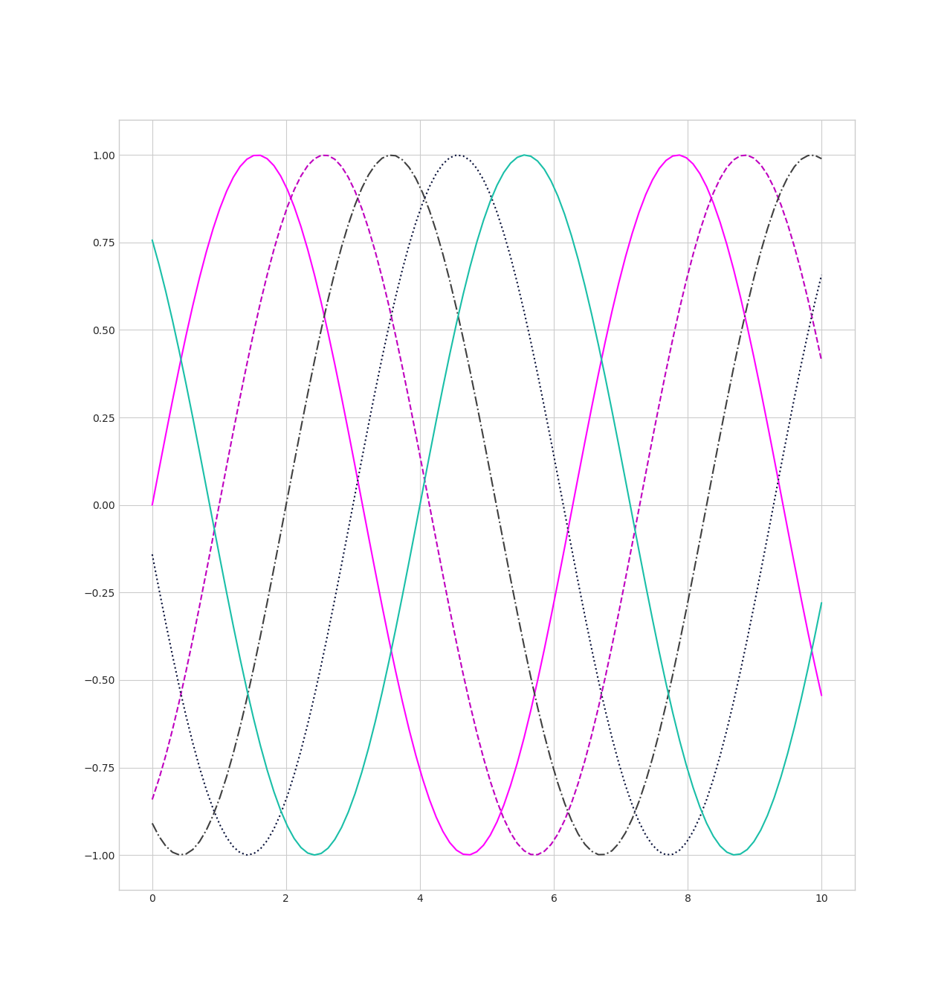
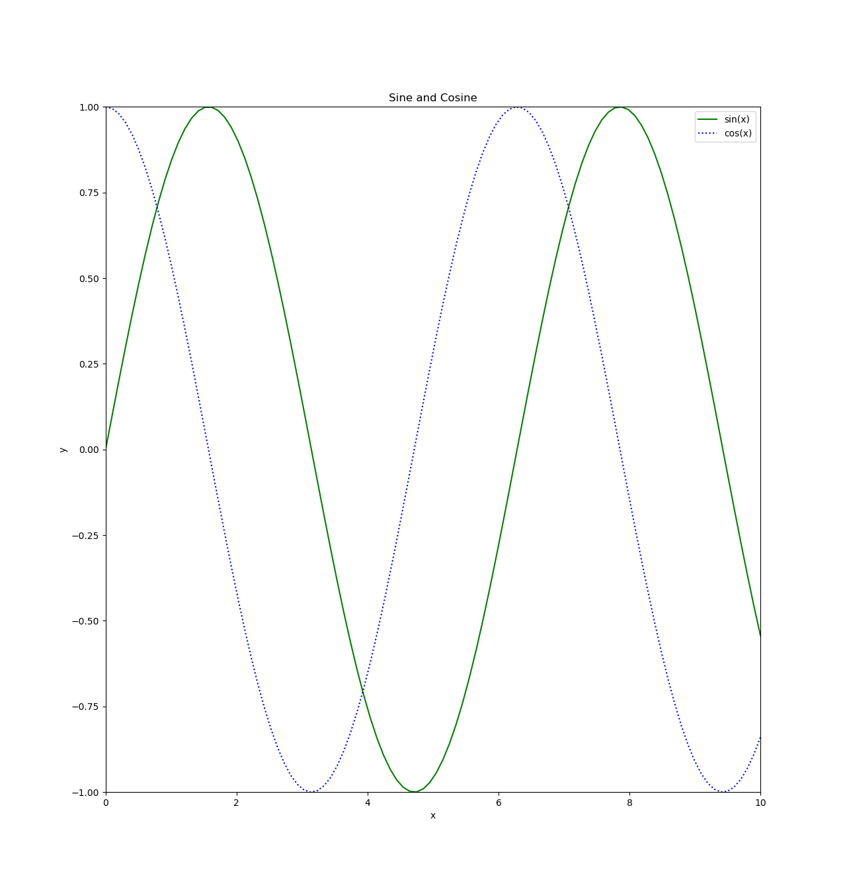

# Matplotlib

Matplotlib is a multiplatform data visualization library built on NumPy arrays.
It supports different graphic backends and output styles, and works on
virtually any platform. Some projects, including Pandas, offer wrappers around
the API of Matplotlib. It is, however, still useful to know how to deal
directly with Matplotlib.

Conventionally, Matplotlib is imported as follows:

```python
>>> import matplotlib as mpl
>>> import matplotlib.pyplot as plt
```

The plot style can be set on the `plt` object:

```python
>>> plt.style.use('classic')
```

Depending on the context, there are different ways of opening the plots for
display.

From a script, the method `plt.show()` opens all figures plotted so far:

```python
import matplotlib as mpl
import matplotlib.pyplot as plt
import numpy as np

x = np.linspace(0, 10, 100)
plt.plot(x, np.sin(x))
plt.plot(x, np.cos(x))

plt.show()
```

The method `plt.show()` must onle be used once per script or session.

Plots created in a IPython shell can be displayed automatically by calling the
`%matplotlib` magic command before calling methods on the `plt` object. The
plot will be displayed in a separate window. The method `plt.draw()` forces the
output to be updated.

```python
>>> import matplotlib as mpl
>>> import matplotlib.pyplot as plt
>>> import numpy as np

>>> %matplotlib
Using matplotlib backend: Qt5Agg

>>> x = np.linspace(0, 10, 100)
>>> plt.plot(x, np.sin(x))
```

From within a Jupyter Notebook, there are two options to display plots:

1. `%matplotlib inline`: display plots as static images
2. `%matplotlib notebook`: display interactive plots

The latter option will draw every plot output in the most recent figure, which
can be created using the `plt.figure()` method:

```python
import matplotlib as mpl
import matplotlib.pyplot as plt
import numpy as np

x = np.linspace(0, 10, 100)

%matplotlib notebook

plt.figure()
plt.plot(x, np.sin(x))
plt.plot(x, np.cos(x))
```

A figure object can be saved using its `savefig()` method, which requires a
file name. Notice that the `plot()` method only draws into the most recent
figure object created, if the magic command `%matplotlib` hasn't been used
before:

```python
import matplotlib as mpl
import matplotlib.pyplot as plt
import numpy as np

fig = plt.figure()
x = np.linspace(0, 10, 100)
plt.plot(x, np.sin(x))
plt.plot(x, np.cos(x))
fig.savefig('sin-x-cos-x.png')
```


An image--no longer a plot!--can be loaded using IPython's `Image` object:

```python
>>> from IPython.display import Image, display
>>> img = Image('sin-x-cos-x.png')
>>> display(img)
```

For both saving and loading, the file format is inferred from the file's
extension. The formats supported by the graphics backend in use can be
retrieved as a dictionary from a `figure` object:

```python
>>> import matplotlib as mpl
>>> import matplotlib.pyplot as plt

>>> fig = plt.figure()
>>> fig.canvas.get_supported_filetypes()
{'ps': 'Postscript',
 'eps': 'Encapsulated Postscript',
 'pdf': 'Portable Document Format',
 'pgf': 'PGF code for LaTeX',
 'png': 'Portable Network Graphics',
 'raw': 'Raw RGBA bitmap',
 'rgba': 'Raw RGBA bitmap',
 'svg': 'Scalable Vector Graphics',
 'svgz': 'Scalable Vector Graphics'}
```

## Interfaces: MATLAB-style and Object Oriented

Matplotlib started out as a Python alternative for MATLAB. The `plt` object
represents the stateful interface known to MATLAB users. Plots created on the
`plt` object are drawn to the figure and axes objects that have been created
most recently.

In this example, two subplots on a single figure are created:

```python
import matplotlib.pyplot as plt
import numpy as np

x = np.linspace(0, 10, 100)
plt.figure() # create a new figure
plt.subplot(2, 1, 1) # (row, column, panel): first panel on a 2*1 field
plt.plot(x, np.sin(x)) # plot to the first subplot
plt.subplot(2, 1, 2) # second panel on the same 2*1 field
plt.plot(x, np.cos(x)) # plot to the second subplot
plt.show()
```


It is possible to plot on other figures/axes than the current active, but only
if their references have been retrieved and stored using `plt.gcf()` (get
current figure) and `plt.gca()` (get current axes):

```python
import matplotlib.pyplot as plt
import numpy as np

x = np.linspace(0, 10, 100)
plt.figure()
plt.subplot(2, 1, 1)
plt.plot(x, np.sin(x))
first = plt.gca() # store reference to first aces
plt.subplot(2, 1, 2)
plt.plot(x, np.cos(x))
first.plot(x, np.cos(x)) # also draw cosine on first axes
plt.show()
```


"Going back" is not possible if one fails to store the such references,
especially in an interactive session. The object-oriented interface of
Matplotlib doesn't rely on a _current state_, but requires the user to always
explicitly refer to the figure/axes to be dealt with:

```python
import matplotlib.pyplot as plt
import numpy as np

x = np.linspace(0, 10, 100)
fig, ax = plt.subplots(2)
ax[0].plot(x, np.sin(x))
ax[1].plot(x, np.cos(x))
ax[0].plot(x, np.cos(x))
plt.show()
```

The choice between the two interfaces is mostly a matter of preference for
simple tasks. More complicated plots, however, do require the object-oriented
approach.

## Line Plots

Simple functions of the form `y=f(x)` can be visualized using line plots. The
following examples require this boilerplate code:

```python
import matplotlib.pyplot as plt
import numpy as np

%matplotlib inline

plt.style.use('seaborn-whitegrid') # simple style

x = np.linspace(0, 10, 100) # 100 points in range 0..10
```

A figure, implemented by `plt.Figure`, contains all the graphics objects, like
text, labels -- and the axes. A axes, implemented by `plt.Aces`, is a bounding
box with ticks and labels, which contains the plotted lines. Conventionally,
the objects are called `fig` and `ax`:

```python
fig = plt.figure()
ax = plt.axes()
```

The sine function of the `x` values computed before can be drawn using the aces
`plot()` method:

```python
ax.plot(x, np.sin(x)) # plot x and y=sin(x)
```

The MATLAB-style interface can be used alongsinde, plotting to the figure/axes
used most recently:

```python
plt.plot(x, np.cos(x)) # plot x and y=cos(x)
```

The lines get a color assigned automatically from a predefined set. The colors
can also be assigned manually using the `color` keyword of the `plot()` method.
The following options are supported:

- HTML color name: `blue`, `green`, `fuchsia` etc. (common HTML color names)
- RGB/CMYK short code: `r`, `g`, `b`, `c`, `m`, `y`, `k`
- Grayscale value: floating point number between `0` (black) and `1` (white)
- RGB hex code: `#ff00aa`, `#efefef`
- RGB tuple with floating point numbers between `0` and `1`: `(0.1, 0.75, 0.66)`

The line style can be adjusted using the `linestyle` keyword. The following
options are supported, both having a short and a long form:

- `-`/`solid`
- `--`/`dashed`
- `-.`/`dashdot`
- `:`/`dotted`

```python
ax.plot(x, np.sin(x-0), color='fuchsia', linestyle='-')
ax.plot(x, np.sin(x-1), color='m', linestyle='--')
ax.plot(x, np.sin(x-2), color='0.25', linestyle='-.')
ax.plot(x, np.sin(x-3), color='#0a123b', linestyle=':')
ax.plot(x, np.sin(x-4), color=(0.1, 0.75, 0.66))
```



The MATLAB-style interface `plt.plot()` accepts a shorthand style indicator as
a third non-keyword argument, combining a line style with a a RGB/CMYK color
code:

```python
plt.plot(x, np.sin(x-5), ':y') # dotted yellow line
```

## Limits, Labels, Legends

The axes limits can be set using the `plt.xlim()` and `plt.ylim()` function
(MATLAB-style) or using the `ax.set_xlim()` and `ax.set_ylim()` method
(OO-style) by passing a lower and a upper bound:

```
plt.xlim(-5, 5)
plt.ylim(-1, 1)
```

A plot can be flipped along both axis by passing the arguments in reverse
order (using an `axes` object here):

```
ax.set_xlim(5, -5)
ax.set_ylim(1, -1)
```

The `plt.axis()` method allows to set both ranges at once by providing a list
of the form `[xmin, xmax, ymin, ymax]`:

```python
plt.axis([-5, 5, -1, 1])
```

The ranges can be set automatically to just fit in the plot by using the
`'tight'` parameter:

```python
plt.axis('tight')
```

The `'equal'` parameter makes sure the plot fits in and that the x and y axis
are scaled equally:

```python
plt.axis('equal')
```

The axes object supports the same method: `ax.axis()`.

Both axis and the plot as a whole can be labeled using the `plt.xlabel()`,
`plt.ylabel()` and `plt.title()` function (MATLAB-style) or the
`ax.set_xlabel()`, `ax.set_ylabel()`, `ax.set_title()` method (OO-style):

```python
plt.xlabel('x')
plt.ylabel('y=sin(x)')
plt.title('A Sine Curve')

ax.set_xlabel('x')
ax.set_ylabel('y=cos(x)')
ax.set_title('A Cosine Curve')
```

Lines with different styles and colors can be labeled with a legend by calling
the `plt.legend()` function or the `ax.legend()` method, which requires the
individual plots (as opposed to its axis) to be labeled with the `plot()` call
(keyword `label`):

```python
plt.plot(x, np.sin(x), '-g', label='sin(x)')
plt.plot(x, np.cos(x), ':b', label='cos(x)')
plt.legend()

ax.plot(x, np.sin(x), color='green', linestyle='-', label='sin(x)')
ax.plot(x, np.cos(x), color='blue', linestyle=':', label='cos(x)')
ax.legend()
```

The `ax.set()` method is a convenient interface for setting limits (using
tuples), labels and a title all at once:

```python
ax.set(xlim=(0, 10), ylim=(-1, 1),
       xlabel='x', ylabel='sin(x)',
       title='A Sine Curve')
```

Bringing it all together (in a script):

```python
import matplotlib.pyplot as plt
import numpy as np

x = np.linspace(0, 10, 100)

ax = plt.axes()
ax.set(xlim=(0, 10), ylim=(-1, 1),
       xlabel='x', ylabel='y',
       title='Sine and Cosine')

ax.plot(x, np.sin(x), color='green', linestyle='-', label='sin(x)')
ax.plot(x, np.cos(x), color='blue', linestyle=':', label='cos(x)')
ax.legend()

plt.show()
```


